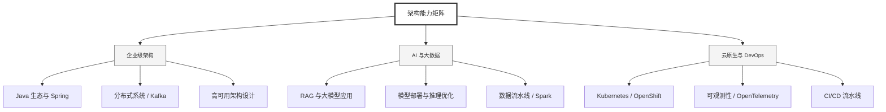

  <h1>你好，我是 Ellen Liu 👋</h1>
  

    <a href="README.md">English</a> | 
    <b>简体中文</b>
  

## 🧠 技术栈与核心能力

智能化企业系统建设路线图，涵盖全栈人工智能工程、云基础设施架构及模型部署等核心技术领域。

```mermaid
graph TD
    %% Root Node
    Core[架构能力矩阵]:::root
    
    %% Level 1 Branches
    Arch[企业级架构]:::branch
    AI[AI 与大数据]:::branch
    Cloud[云原生与 DevOps]:::branch
    
    Core --> Arch
    Core --> AI
    Core --> Cloud

    %% Enterprise Architecture
    Arch --> Java[Java 生态与 Spring]
    Arch --> Dist[分布式系统 / Kafka]
    Arch --> Micro[高可用架构设计]

    %% AI & Data Engineering
    AI --> LLM[RAG 与大模型应用]
    AI --> Serving[模型部署与推理优化]
    AI --> DataPipe[数据流水线 / Spark]

    %% Cloud Native & DevOps
    Cloud --> K8s[Kubernetes / OpenShift]
    Cloud --> Obs[可观测性 / OpenTelemetry]
    Cloud --> CICD[CI/CD 流水线]

    %% Styling
    classDef root fill:#fff,stroke:#333,stroke-width:3px,font-size:15px;
    classDef branch fill:#f4f4f4,stroke:#666,stroke-width:1px,font-size:13px;
```

## 🚀 Highlighted 工作

- **开源 AI 项目**: [基于 BERT 的声明检测模型](https://huggingface.co/XiaojingEllen/bert-finetuned-claim-detection) (Apache-2.0)
  - *已被哥伦比亚大学 (UBC) 研究项目引用。*
  - *手写 Transformer 核心代码，以验证理论与工程的一致性。*
- **金融基础设施**: 从 0 到 1 构建数字银行支付中间件及智能保险理赔系统。

## 📑 每日论文速递 (ArXiv)
<!-- DAILY_ARXIV_SUMMARY_START -->
**更新日期: 2026-09-24**

### 1. [大型语言模型能否对运行时行为进行推理？一个仓库级别的动态基准测试](http://arxiv.org/abs/2609.28449v1)
- **摘要**: 大型语言模型（LLMs）正越来越多地应用于编码任务，但其对代码执行的推理能力仍不明确。现有的仓库级问答基准主要评估静态代码理解，且往往依赖基于LLM的评估，而执行推理基准大多局限于代码片段或函数。我们提出SWE-Flux，一个面向动态执行推理的仓库级基准，包含来自12个真实Python仓库的480个基于执行的实例，其标准答案通过插桩测试执行自动采集，而非人工编写或由LLM评判。该基准涵盖针对控制流、循环、程序状态、数据流、异常和程序不变量的单测试与多测试问题。对五个LLM的评估表明，该任务仍具挑战性。最佳模型仅达到37%的准确率。模型在诸如不变量、过程内控制流、异常和简单循环等局部行为上表现较好，但在数据流、过程间执行、精确状态推理和套件级聚合方面表现不佳。最后，我们表明该预言采集流水线能够利用输入扰动生成新的基准变体。它成功为近90%的选定实例采集到有效变体，且所得变体对受评估模型而言难度显著增加。

### 2. [跨尺度迁移学习用于抑郁严重程度预测：从PHQ-8到HAMD-17，跨越语言和临床范式](http://arxiv.org/abs/2609.28430v1)
- **摘要**: 本研究针对数据稀缺条件下基于临床访谈转录文本的抑郁严重程度连续评分预测问题。我们提出了一种用于跨尺度迁移的序列低秩适配（LoRA）方案：首先在英文DAIC-WOZ数据集（189个虚拟形象介导的会话，PHQ-8）上微调带有有界回归头的Qwen3骨干模型，随后该适配器用于初始化中文PDCH数据集（100次真实临床咨询，HAMD-17）上的微调，其中重新初始化、尺度特定的回归头预测临床医生分配的评分。所有配置均采用患者级分层5折、2次重复交叉验证。在数据稀缺的HAMD-17目标上，该序列方案在0.6B和1.7B骨干模型上均取得了最佳点估计MAE、RMSE和宏$F_1$，优于仅目标训练和非LLM基线——Qwen3-0.6B为4.96/6.59/0.36，Qwen3-1.7B为4.38/5.62/0.46。消融实验表明，正确对齐的源监督给出最佳点估计（无监督暴露和打乱标签的对照也显示出部分增益），原生中文目标输入优于机器翻译的英文输入，而颠倒顺序在运行间方差范围内未产生明显增益。本研究是一项探索性、单中心内部评估：它不确立筛查或诊断效用，也未单独识别量表、语言或范式转变的贡献。据我们所知，此前没有研究评估这一特定的DAIC-WOZ到PDCH序列迁移设置。

### 3. [智能体编辑世界模型：重新思考面向大型语言模型智能体的世界建模](http://arxiv.org/abs/2609.28416v1)
- **摘要**: 大语言模型（LLMs）的最新进展使智能体能够在多样环境中处理长时程任务。为了进一步提升智能体性能，现有的语言世界模型通常预测环境观测，但在真实反馈可用时，重建高熵、依赖执行的工具响应价值有限。与此同时，智能体面临\emph{任务状态污染}问题，即无依据的假设和过时的计划在历史中持续存在并扭曲后续决策。我们提出\textbf{智能体编辑世界模型（AEWM）}，它建模推理和行动如何塑造未来任务进展，而非模拟工具响应。AEWM结合\textbf{行动评判器}来区分\textsc{关键}、\textsc{探索性}和\textsc{噪声}决策，并通过\textbf{状态修正}从同一观测历史中编辑噪声推理—行动延续。\textbf{EditAct}将这些能力与真实执行相结合，直接改变后续决策所依据的状态，而不仅仅是提供批评。我们通过中期训练和监督微调在搜索、终端和软件工程领域训练AEWM。AEWM在我们的行动评判器基准上达到70.5\%的宏F1，超过最强前沿基线10.6个百分点。在六个基准和三个智能体骨干上，EditAct相比最强基线将平均分数提高3.2—6.7个百分点。此外，对经过验证的EditAct轨迹进行拒绝采样微调，称为\textbf{AEWM-RFT}，在没有在线AEWM指导的情况下，在三个领域上比Self-RFT提高2.2—2.6个百分点。

<!-- DAILY_ARXIV_SUMMARY_END -->

## 🌐 保持联系

  
<i>期待与您探讨 AI 基础设施的未来！</i>

