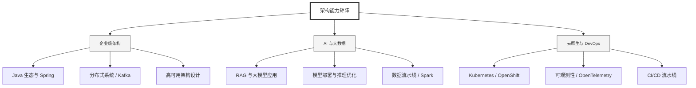

  <h1>你好，我是 Ellen Liu 👋</h1>
  

    <a href="README.md">English</a> | 
    <b>简体中文</b>
  

## 🧠 技术栈与核心能力

智能化企业系统建设路线图，涵盖全栈人工智能工程、云基础设施架构及模型部署等核心技术领域。

```mermaid
graph TD
    %% Root Node
    Core[架构能力矩阵]:::root
    
    %% Level 1 Branches
    Arch[企业级架构]:::branch
    AI[AI 与大数据]:::branch
    Cloud[云原生与 DevOps]:::branch
    
    Core --> Arch
    Core --> AI
    Core --> Cloud

    %% Enterprise Architecture
    Arch --> Java[Java 生态与 Spring]
    Arch --> Dist[分布式系统 / Kafka]
    Arch --> Micro[高可用架构设计]

    %% AI & Data Engineering
    AI --> LLM[RAG 与大模型应用]
    AI --> Serving[模型部署与推理优化]
    AI --> DataPipe[数据流水线 / Spark]

    %% Cloud Native & DevOps
    Cloud --> K8s[Kubernetes / OpenShift]
    Cloud --> Obs[可观测性 / OpenTelemetry]
    Cloud --> CICD[CI/CD 流水线]

    %% Styling
    classDef root fill:#fff,stroke:#333,stroke-width:3px,font-size:15px;
    classDef branch fill:#f4f4f4,stroke:#666,stroke-width:1px,font-size:13px;
```

## 🚀 Highlighted 工作

- **开源 AI 项目**: [基于 BERT 的声明检测模型](https://huggingface.co/XiaojingEllen/bert-finetuned-claim-detection) (Apache-2.0)
  - *已被哥伦比亚大学 (UBC) 研究项目引用。*
  - *手写 Transformer 核心代码，以验证理论与工程的一致性。*
- **金融基础设施**: 从 0 到 1 构建数字银行支付中间件及智能保险理赔系统。

## 📑 每日论文速递 (ArXiv)
<!-- DAILY_ARXIV_SUMMARY_START -->
**更新日期: 2026-08-21**

### 1. [SPADE：自适应合成可执行环境中的自我对弈](http://arxiv.org/abs/2608.19197v1)
- **摘要**: 持续的自我提升需要不断扩大的、自我生成的、多样化的、适应性目标池。对于语言智能体而言，现有的训练环境池（手工策划、静态合成或冻结验证器）在学习者规模扩展时保持了目标分布的固定不变。我们引入了SPADE（自适应合成可执行环境中的自我对弈），这是一种自我对弈强化学习框架，其中单个大型语言模型扮演两个角色：一个环境设计者，负责编写完整、长时域的训练环境，以可执行代码的形式呈现，并带有OpenAI Gym风格的reset()/step()接口；以及一个推理智能体，学习在这些环境中行动。每个角色都处于有状态、多轮交互的环境中（包括状态转换、奖励函数和验证代码），因此一个接口即可涵盖推理问题和多步智能体工具使用。推理智能体的遗憾值通过其在有特权提示和无特权提示下的奖励差距来估计；在优化这一遗憾信号的过程中，环境设计者学会将目标环境定位在智能体能力的边缘，同时确保这些环境是可行的。通过大量实验，我们发现了几个对成功至关重要的组件：将环境设计者基于从大型预训练语料库中采样的文档进行接地，并赋予其累积的环境记忆。将模型规模扩展到300亿参数时，SPADE在八个保留的数学、科学、代码和推理基准测试中，平均比最强的固定环境基线提高了+5.3；在工具使用场景中，BFCL-v4多轮任务上提升了+5.7，ACEBench-Agent上提升了+13.9；在游戏场景中，与最强基线的差距随模型规模增大而扩大。通过将环境设计本身变为一个可学习的组件，SPADE向开放式自我提升迈出了坚实的一步。

### 2. [当可读性与源文保留出现分歧：AI翻译中的可评估性差距](http://arxiv.org/abs/2608.19083v1)
- **摘要**: 可读性强的AI输出可能留下可评估性缺口：即使展示了源文本，整体质量判断也可能无法反映输出所保留的内容。我们研究了源文本条件与输出呈现方式如何影响感知翻译质量，以及在纯文本界面中，输出和系统评估如何与信任及声明的披露意愿相关联。一项以TransLingo为工具的焦点2×2比较（N=306）考察了简单生成叙事和复杂文学哲学散文，同时涉及大语言模型生成的面向可读性的输出和研究者修订的面向保真度的输出。描述性刺激审计表明，在两种源文本条件下，面向保真度的输出均保留了更多源文本内容。因子分析显示，感知质量中存在显著的呈现方式与源文本条件交互效应。对于简单叙事，参与者对面向保真度输出的评分高于面向可读性输出，而在复杂散文中，未出现可靠的呈现方式差异。在感知智能、面向能动性的拟人化归因和任务绩效信任方面，也观察到了相应的源条件依赖模式。一项独立的理论有序评估结构方程模型（SEM）刻画了感知质量、感知智能、面向能动性的拟人化归因、任务绩效信任以及跨六个领域声明的披露意愿之间的并发关联，其中任务绩效信任是声明意愿的近端相关因素。观察到的评分模式区分了源文本可及性与源文本可评估性：对于复杂刺激，展示源文本并不能确保整体质量评分反映保留内容的差异。该模式还将对翻译输出评估的支持与对数据处理的支持区分开来，后者涉及决定将哪些个人文本托付给系统。

### 3. [AI后训练中缺失了什么：一项实证分析](http://arxiv.org/abs/2608.19072v1)
- **摘要**: 大型语言模型（LLM）智能体现在能够端到端地对LLM进行后训练。它们可以编写代码、启动训练、评估检查点，并提升下游性能，这引发了“AI为AI”的前景。我们认为，这一图景混淆了两种截然不同的能力：执行层面的能力，即在选定的训练策略内进行迭代；以及策略层面的能力，即随着实验证据的积累而修正高层判断。通过分析大量公开的后训练轨迹语料，我们发现，在不同任务中，智能体的训练策略在最初阶段就被锁定，而剩余的整个预算都花在了所选策略内的局部调整上。接着，我们考察了三种自然的解释——经验缺失、指导缺失和推理不足——并采取了逐步升级的干预措施。大量实验表明：（1）经验驱动的支架全面提升了执行能力（GSM8K上提升12.6个百分点，HumanEval上提升40.8个百分点），但策略保持静态；（2）人类指导能有效调整初始策略，但一旦训练开始，智能体会重新陷入局部调整循环；（3）额外的推理计算在较简单任务上有所回报，但在最难的任务上几乎毫无增益。总之，智能体所缺乏的既不是经验、指导，也不是推理计算，而是一种在执行过程中自发重新评估其策略的机制。

<!-- DAILY_ARXIV_SUMMARY_END -->

## 🌐 保持联系

  
<i>期待与您探讨 AI 基础设施的未来！</i>

