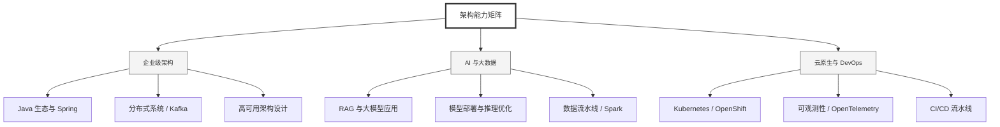

  <h1>你好，我是 Ellen Liu 👋</h1>
  

    <a href="README.md">English</a> | 
    <b>简体中文</b>
  

## 🧠 技术栈与核心能力

智能化企业系统建设路线图，涵盖全栈人工智能工程、云基础设施架构及模型部署等核心技术领域。

```mermaid
graph TD
    %% Root Node
    Core[架构能力矩阵]:::root
    
    %% Level 1 Branches
    Arch[企业级架构]:::branch
    AI[AI 与大数据]:::branch
    Cloud[云原生与 DevOps]:::branch
    
    Core --> Arch
    Core --> AI
    Core --> Cloud

    %% Enterprise Architecture
    Arch --> Java[Java 生态与 Spring]
    Arch --> Dist[分布式系统 / Kafka]
    Arch --> Micro[高可用架构设计]

    %% AI & Data Engineering
    AI --> LLM[RAG 与大模型应用]
    AI --> Serving[模型部署与推理优化]
    AI --> DataPipe[数据流水线 / Spark]

    %% Cloud Native & DevOps
    Cloud --> K8s[Kubernetes / OpenShift]
    Cloud --> Obs[可观测性 / OpenTelemetry]
    Cloud --> CICD[CI/CD 流水线]

    %% Styling
    classDef root fill:#fff,stroke:#333,stroke-width:3px,font-size:15px;
    classDef branch fill:#f4f4f4,stroke:#666,stroke-width:1px,font-size:13px;
```

## 🚀 Highlighted 工作

- **开源 AI 项目**: [基于 BERT 的声明检测模型](https://huggingface.co/XiaojingEllen/bert-finetuned-claim-detection) (Apache-2.0)
  - *已被哥伦比亚大学 (UBC) 研究项目引用。*
  - *手写 Transformer 核心代码，以验证理论与工程的一致性。*
- **金融基础设施**: 从 0 到 1 构建数字银行支付中间件及智能保险理赔系统。

## 📑 每日论文速递 (ArXiv)
<!-- DAILY_ARXIV_SUMMARY_START -->
**更新日期: 2026-07-25**

### 1. [MedGame: Storytelling Gamification Empowered by Large Language Models for Medical Education](http://arxiv.org/abs/2607.21570v1)
- **摘要**: Large Language Models (LLMs) show promise for medical education, but most existing systems focus on localized interactions such as question answering or single-turn feedback, rather than organizing an entire clinical case into a decision-centered learning trajectory. We introduce \textit{MedGame}, a framework that transforms static clinical cases into structured, executable storytelling games. MedGame uses a dual-engine design: a Medical Narrative Designer synthesizes case-grounded clinical storylines with states and decision nodes, while a Story Director converts them into dependency-aware multimodal orchestration plans rendered by our released interactive platform. We construct MedGame Bench, a 5,000-case benchmark and evaluation protocol for Medical Narrative Generation and Story Direction. Experiments show that task-specific fine-tuning substantially improves open-source LLMs on MedGame Bench and narrows the gap with commercial models. A pilot student study further shows that learners perceive MedGame as more engaging and useful than text-only alternatives.

### 2. [OpenForgeRL: Train Harness-native Agents in Any Environment](http://arxiv.org/abs/2607.21557v1)
- **摘要**: Modern AI agents rely on elaborate inference harnesses such as Claude Code, Codex, and OpenClaw to drive multi-turn reasoning, tool use, and access to external systems. While powerful, these complex harnesses also make agents hard to train end-to-end with open infrastructure, whose SFT/RL stacks cannot natively express stateful, multi-process harness inference. To address this, we present OpenForgeRL, an open-source framework for training harness-based agents end-to-end in diverse environments. OpenForgeRL achieves this with a lightweight proxy that serves the harness's model calls while recording them as training data for a standard RL codebase (e.g., veRL), and a Kubernetes orchestrator that runs each rollout in its own remote container, together enabling training on any harness in any environment at scale. By decoupling training and inference, OpenForgeRL allows researchers to easily train, study, and improve agents directly in the real harnesses and environments they are deployed with. We validate our framework across diverse, complex harnesses and environments, spanning tool/claw-based agents and multimodal GUI browser- and computer-use agents. Using only hundreds to a few thousand tasks, OpenForgeClaw reaches 31.7 pass^3 and 55.9 pass@3 on ClawEval and 33.7 on QwenClawBench. OpenForgeGUI reaches 37.7 on OSWorld-Verified, 63.0 on Online-Mind2Web, and 72.3 on WebVoyager. Both outperform open baselines of similar size on nearly all benchmarks, and in the GUI setting match or surpass models several times larger. Beyond benchmarks, we analyze how harness choice (e.g., ZeroClaw, OpenClaw, Codex) and RL shape agent behavior. We find that some harnesses are substantially harder to learn than others, and that RL improves agentic reliability, such as self-verification, tool coverage, and completing multi-step plans, though critical abilities such as error recovery remain weak.

### 3. [GS-Agent: Creating 4D Physical Worlds With Generative Simulation](http://arxiv.org/abs/2607.21522v1)
- **摘要**: Creating dynamic and physically realistic 4D worlds from natural language descriptions is both fascinating and challenging. Traditional computer graphics methods rely on manual creation, requiring extensive human effort to fine-tune materials, motions, and visual fidelity. Recent advances in generative foundation models have sparked interest in learning to generate such 4D worlds from large-scale data; however, existing methods still struggle to ensure physical plausibility and controllability. In this work, we take a different path by leveraging foundation models to construct an agentic system that emulates how humans traditionally create 4D worlds, yet automates the entire process. We present GS-Agent, an end-to-end multi-agent framework that integrates physics engines in the loop to generate realistic, dynamic, and controllable 4D physical worlds from natural language. Inspired by how humans build 4D worlds, GS-Agent decomposes the task into entity management, covering 3D asset curation, material tuning, placement, and motion control, and rendering configuration, including camera and lighting manipulation. Multiple agents with distinct expertise interact with the physics engine via code, seek multimodal feedback, and collaborate to iteratively construct 4D worlds that align with the given descriptions. Experimental results show that GS-Agent effectively converts natural language into diverse and physically plausible 4D worlds exhibiting rich interactions among liquids, deformable objects, and rigid bodies, while achieving cinematic camera and lighting control. We envision GS-Agent as a foundation for a new paradigm in 4D world generation, empowering creative content creation and physical AI. Project page at https://umass-embodied-agi.github.io/gs-agent/

<!-- DAILY_ARXIV_SUMMARY_END -->

## 🌐 保持联系

  
<i>期待与您探讨 AI 基础设施的未来！</i>

