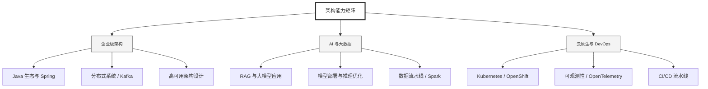

  <h1>你好，我是 Ellen Liu 👋</h1>
  

    <a href="README.md">English</a> | 
    <b>简体中文</b>
  

## 🧠 技术栈与核心能力

智能化企业系统建设路线图，涵盖全栈人工智能工程、云基础设施架构及模型部署等核心技术领域。

```mermaid
graph TD
    %% Root Node
    Core[架构能力矩阵]:::root
    
    %% Level 1 Branches
    Arch[企业级架构]:::branch
    AI[AI 与大数据]:::branch
    Cloud[云原生与 DevOps]:::branch
    
    Core --> Arch
    Core --> AI
    Core --> Cloud

    %% Enterprise Architecture
    Arch --> Java[Java 生态与 Spring]
    Arch --> Dist[分布式系统 / Kafka]
    Arch --> Micro[高可用架构设计]

    %% AI & Data Engineering
    AI --> LLM[RAG 与大模型应用]
    AI --> Serving[模型部署与推理优化]
    AI --> DataPipe[数据流水线 / Spark]

    %% Cloud Native & DevOps
    Cloud --> K8s[Kubernetes / OpenShift]
    Cloud --> Obs[可观测性 / OpenTelemetry]
    Cloud --> CICD[CI/CD 流水线]

    %% Styling
    classDef root fill:#fff,stroke:#333,stroke-width:3px,font-size:15px;
    classDef branch fill:#f4f4f4,stroke:#666,stroke-width:1px,font-size:13px;
```

## 🚀 Highlighted 工作

- **开源 AI 项目**: [基于 BERT 的声明检测模型](https://huggingface.co/XiaojingEllen/bert-finetuned-claim-detection) (Apache-2.0)
  - *已被哥伦比亚大学 (UBC) 研究项目引用。*
  - *手写 Transformer 核心代码，以验证理论与工程的一致性。*
- **金融基础设施**: 从 0 到 1 构建数字银行支付中间件及智能保险理赔系统。

## 📑 每日论文速递 (ArXiv)
<!-- DAILY_ARXIV_SUMMARY_START -->
**更新日期: 2026-09-21**

### 1. [多跳检索中的可预测失败：分数分布置信度评分与弃权](http://arxiv.org/abs/2609.22056v1)
- **摘要**: 多跳检索失败并非在查询间均匀分布：它们聚集在结构上可预测的子群体中。我们证明了两项结果，将这一结构形式化。第一（CWAR可归约性）：当且仅当检索特征携带关于成功与否的互信息时，自信失败归约才可实现；该条件被LLM评判流水线满足，但在纯稠密设置中显著更弱，这解释了两种机制之间的AUC-AC差距。第二（特征机制互补性）：没有任何单一ANN评分特征能在所有失败机制下取得最佳预测性能；主导特征因数据集而异（MuSiQue上为查询长度，HoVer上为第1跳集中度），并且一个构造性见证对表明，每个特征在一种机制中必要，而在另一种机制中无贡献。我们在RegimeAbstain中实例化这些原则，该方法计算检索置信分数（RCS），即最多九个查询-ANN结构特征的逻辑函数，所有这些特征均无需任何额外LLM调用即可获得，并用其实现校准的弃答策略。我们定义了自信错误答案率（CWAR）指标，并在三个多跳基准（MuSiQue、2WikiMultiHopQA、HoVer）和两种检索架构（LLM评判和纯稠密）上评估，覆盖五种失败机制，CWAR从14.5%到62.1%不等。在全部五种条件下，RCS相对于八个置信度基线取得了最佳或并列最佳的AUC-AC。在MuSiQue（LLM评判）上，RCS在50%覆盖率下将CWAR从39.5%降至20.6%（相对降低47.8%），ECE=0.035。在MuSiQue上训练的模型迁移到2WikiMultiHopQA时仅损失-0.5pp AUC，证实了机制特征的领域无关结构。

### 2. [基于三信号互补性的LLM智能体可解释记忆决策控制器：置信度与一致性的解耦](http://arxiv.org/abs/2609.22043v1)
- **摘要**: 面向大语言模型的记忆系统主要聚焦于高效检索，而关于检索到的记忆是否应被信任的决策则相对较少受到关注。当记忆存储中包含相互冲突的立场时，标准的检索增强生成（RAG）会盲目注入记忆并放大幻觉：在易受记忆注入影响的模型中，冲突记忆下的RAG幻觉率显著高于无记忆基线。受前额叶皮层记忆信号机制的启发，我们提出记忆决策层（MDL），一种位于检索与生成阶段之间的零参数记忆决策控制器。其核心是一个三信号互补编码器，通过基于QR的正交子空间投影将相关性、可靠性和任务风险与元工作记忆信号融合为可解释的决策表示，以量化检索记忆的可信度。在此编码器基础上，MDL显式地将置信度与一致性解耦，并引入风险反转和显式弃权。在主流大语言模型和多个开源数据集上的评估表明，MDL在一般场景下将冲突记忆下的幻觉率降低约56.04%，在高风险场景下接近零幻觉。该控制器完全白盒：仅依赖几何运算，无需训练参数，每次决策仅增加约0.14毫秒——比其之前的嵌入检索步骤快约50倍，比LLM自评估调用快四到五个数量级。

### 3. [古兰经MMLU：一个认知感知基准，用于评估生成式AI在古兰经语言知识上的解决方案](http://arxiv.org/abs/2609.22038v1)
- **摘要**: 我们提出QuranicMMLU，一个用于在多个语言复杂性维度上评估生成式AI对古兰经阿拉伯语理解能力的基准。现有的古兰经基准主要集中于通用问答和语义检索，既未探查特定的语言能力，也未按认知需求和经文难度进行分层。我们构建了一个五支柱的古兰经分类体系，涵盖音系学、形态学、句法学、语义学和语用学，下设31个叶节点，覆盖从tajwīd（诵经规则）和词根-模式形态学到降示背景和跨章连贯性等现象。对于每个叶节点，我们按Bloom认知层级和经文困惑度分层生成问题，然后由LLM作为评判者独立回答并评分每个条目，并将标注结果转交人工审核。最终数据集包含980个经人工审核的问题，每个问题均以开放式和多项选择两种形式呈现。我们在这些条目上对12个系统进行了基准测试，发现伊斯兰专门化模型领先，但所有系统在多项选择准确率上的得分（平均84%）均高于开放式答案质量（平均60%）：两种排名高度一致（Kendall's τ=0.73），但多项选择评分掩盖了只有在移除选项后才会暴露的失败。因此，QuranicMMLU为古兰经领域的阿拉伯语NLP评估提供了一个严谨的、以语言学为基础的框架。

<!-- DAILY_ARXIV_SUMMARY_END -->

## 🌐 保持联系

  
<i>期待与您探讨 AI 基础设施的未来！</i>

