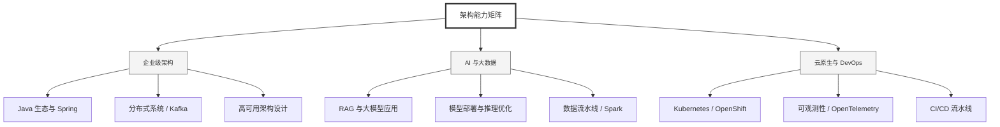

  <h1>你好，我是 Ellen Liu 👋</h1>
  

    <a href="README.md">English</a> | 
    <b>简体中文</b>
  

## 🧠 技术栈与核心能力

智能化企业系统建设路线图，涵盖全栈人工智能工程、云基础设施架构及模型部署等核心技术领域。

```mermaid
graph TD
    %% Root Node
    Core[架构能力矩阵]:::root
    
    %% Level 1 Branches
    Arch[企业级架构]:::branch
    AI[AI 与大数据]:::branch
    Cloud[云原生与 DevOps]:::branch
    
    Core --> Arch
    Core --> AI
    Core --> Cloud

    %% Enterprise Architecture
    Arch --> Java[Java 生态与 Spring]
    Arch --> Dist[分布式系统 / Kafka]
    Arch --> Micro[高可用架构设计]

    %% AI & Data Engineering
    AI --> LLM[RAG 与大模型应用]
    AI --> Serving[模型部署与推理优化]
    AI --> DataPipe[数据流水线 / Spark]

    %% Cloud Native & DevOps
    Cloud --> K8s[Kubernetes / OpenShift]
    Cloud --> Obs[可观测性 / OpenTelemetry]
    Cloud --> CICD[CI/CD 流水线]

    %% Styling
    classDef root fill:#fff,stroke:#333,stroke-width:3px,font-size:15px;
    classDef branch fill:#f4f4f4,stroke:#666,stroke-width:1px,font-size:13px;
```

## 🚀 Highlighted 工作

- **开源 AI 项目**: [基于 BERT 的声明检测模型](https://huggingface.co/XiaojingEllen/bert-finetuned-claim-detection) (Apache-2.0)
  - *已被哥伦比亚大学 (UBC) 研究项目引用。*
  - *手写 Transformer 核心代码，以验证理论与工程的一致性。*
- **金融基础设施**: 从 0 到 1 构建数字银行支付中间件及智能保险理赔系统。

## 📑 每日论文速递 (ArXiv)
<!-- DAILY_ARXIV_SUMMARY_START -->
**更新日期: 2026-09-06**

### 1. [可读性不等于可解释性：链式思维推理中评判重要性与实际重要性的比较](http://arxiv.org/abs/2609.04194v1)
- **摘要**: 思维链模型中的推理痕迹，看似为理解模型如何得出答案提供了一扇清晰的窗口。越来越多的研究正是基于这一假设，利用LLM评判器来诊断错误、评估忠实度，并通过过程奖励模型和生成式批评者提供逐步监督。这些实践依赖于推理步骤的文本承载其功能角色的信息。但文本是否真的编码了哪些推理步骤至关重要的信息？我们将推理步骤的重要性操作化为其优势值：即包含该步骤所带来的期望奖励变化，例如，得出正确最终答案的概率变化，并通过蒙特卡洛展开进行估计。基于这些估计作为真实基准，我们评估LLM评判器能否识别高优势步骤，发现能力足够的LLM能超越流行率基线，但仍远低于噪声上限。将模型微调为步骤级批评者，对错误响应有显著改进，但对正确响应仍与上限存在较大差距，这表明步骤重要性仅能从推理痕迹的文本中部分恢复。我们的发现为日益增长的思维链忠实度研究增添了警示，反对将推理痕迹的可读性视为可解释性，尤其对过程奖励建模具有重要启示。

### 2. [预训练阶段的知识获取？大型语言模型借助辅助视角学习效果更佳](http://arxiv.org/abs/2609.04180v1)
- **摘要**: 关于大型语言模型（LLMs）在预训练期间如何获取知识，我们的理解仍存在空白。我们假设，辅助视角，即知识的重新表述，对学习具有因果性的帮助。我们设计了受控实验来隔离这一效应。首先，我们确认重复是知识获取所必需的，并阐明释义仅在较小的批处理规模下有所帮助。其次，在保持令牌预算固定的情况下，将文档重复的令牌分配至辅助视角可改善学习效果，这出乎意料地甚至对事实回忆也有益。第三，辅助视角的有效性并不依赖于生成它们的教师模型的强度。第四，我们识别出上下文性和基础性两种知识形式，它们在存在先前知识空白时有助于学习。最后，我们通过逐层偏差和压缩来考察这些效应在机制上的表现。综合来看，我们的发现表明，大型预训练语料库中自然出现的知识辅助表示，是预训练成功的关键因素，并为数据多样性为何重要提供了合理的解释。

### 3. [终端宇宙：将智能体轨迹转化为可扩展的终端环境](http://arxiv.org/abs/2609.04148v1)
- **摘要**: 随着基于终端的代码代理变得普遍，代理轨迹已大规模积累，而现实、可执行的环境仍然稀缺。然而，环境正是代理后期训练所真正需要的：每个环境都可以被反复查询以生成许多可验证的任务，并提供执行反馈，而轨迹只是一次性的静态演示。我们并非从头生成环境，而是观察到现有轨迹中的工具执行历史揭示了其运行环境的结构和内容，这使得从轨迹本身重建这些环境成为可能。因此，我们引入了Terminal-Universe，这是一个框架，它将每条轨迹转化为可复用的环境，并探索该环境以合成新任务和持续交互。具体来说，Terminal-Universe重放轨迹中记录的文件操作，以在代理修改每个文件之前恢复其原状，从而生成部分工作空间；随后，一个完成代理补充缺失的文件和依赖项。在这个恢复的工作空间上，我们既重建原始意图任务，也合成全新任务。此外，我们还沿着两个互补维度扩展任务：广度和深度。在广度方面，我们挖掘相关环境之间的方向性依赖关系，并合成跨工作空间的查询，涵盖多个代码库，正如开发者在现实开发中经常做的那样。在深度方面，我们将初始的单轮查询扩展为多轮会话，通过用户代理捕捉迭代的用户反馈和需求细化。将Terminal-Universe应用于公开的终端代理轨迹，我们生成了37.3k个任务充分的环境。在此语料库上对Qwen3.5-27B进行监督微调，在Terminal-Bench 2.1上将单轮性能提升了11.9个百分点，在EvoCode-Bench v2 MT@4上将多轮性能提升了13.8个百分点。

<!-- DAILY_ARXIV_SUMMARY_END -->

## 🌐 保持联系

  
<i>期待与您探讨 AI 基础设施的未来！</i>

