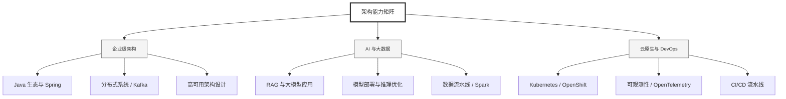

  <h1>你好，我是 Ellen Liu 👋</h1>
  

    <a href="README.md">English</a> | 
    <b>简体中文</b>
  

## 🧠 技术栈与核心能力

智能化企业系统建设路线图，涵盖全栈人工智能工程、云基础设施架构及模型部署等核心技术领域。

```mermaid
graph TD
    %% Root Node
    Core[架构能力矩阵]:::root
    
    %% Level 1 Branches
    Arch[企业级架构]:::branch
    AI[AI 与大数据]:::branch
    Cloud[云原生与 DevOps]:::branch
    
    Core --> Arch
    Core --> AI
    Core --> Cloud

    %% Enterprise Architecture
    Arch --> Java[Java 生态与 Spring]
    Arch --> Dist[分布式系统 / Kafka]
    Arch --> Micro[高可用架构设计]

    %% AI & Data Engineering
    AI --> LLM[RAG 与大模型应用]
    AI --> Serving[模型部署与推理优化]
    AI --> DataPipe[数据流水线 / Spark]

    %% Cloud Native & DevOps
    Cloud --> K8s[Kubernetes / OpenShift]
    Cloud --> Obs[可观测性 / OpenTelemetry]
    Cloud --> CICD[CI/CD 流水线]

    %% Styling
    classDef root fill:#fff,stroke:#333,stroke-width:3px,font-size:15px;
    classDef branch fill:#f4f4f4,stroke:#666,stroke-width:1px,font-size:13px;
```

## 🚀 Highlighted 工作

- **开源 AI 项目**: [基于 BERT 的声明检测模型](https://huggingface.co/XiaojingEllen/bert-finetuned-claim-detection) (Apache-2.0)
  - *已被哥伦比亚大学 (UBC) 研究项目引用。*
  - *手写 Transformer 核心代码，以验证理论与工程的一致性。*
- **金融基础设施**: 从 0 到 1 构建数字银行支付中间件及智能保险理赔系统。

## 📑 每日论文速递 (ArXiv)
<!-- DAILY_ARXIV_SUMMARY_START -->
**更新日期: 2026-08-05**

### 1. [多语言、多智能体规划失败的可操作诊断](http://arxiv.org/abs/2608.03735v1)
- **摘要**: 多语言多智能体系统在英语之外的语言环境中表现出显著的性能退化，然而以往研究很少明确指出，当用户请求被转化为可执行计划时，任务关键信息是如何丢失的。我们将多智能体系统中的规划器视为从请求到行动的接口，并从真实世界任务执行失败中归纳出一个可操作的规划-落地失败分类体系。基于LLM的分析表明，随着语言资源可用性的下降，这些失败在未成功执行案例中所占比例不断增加，且在低资源语言中影响最为显著。为验证该分类体系是否有助于缓解问题，我们引入了TART（Taxonomy-Guided Actionable Representation，分类引导的可操作表示），该机制将分类体系的关键方面明确呈现给规划器及下游子智能体。在多种语言、三种LLM骨干模型、两个数据集及两种智能体配置下，TART均持续提升了性能。在多语言GAIA基准上，TART将现有最优系统的准确率平均提升了5.6个百分点，覆盖了从低资源到高资源设置的十一种语言。

### 2. [GPTKB 2.0：从大型语言模型直接构建消歧知识库](http://arxiv.org/abs/2608.03729v1)
- **摘要**: 自动知识库构建（AKBC）是自然语言处理（NLP）中的一项核心任务，近期研究提出直接从大型语言模型（LLMs）生成知识库，将模型本身视为知识来源。然而，LLMs 天然不具备实体表示能力，导致重复条目和概念混淆问题。我们提出 GPTKB 2.0，一种直接从 LLMs 构建消歧知识库的方法。GPTKB 2.0 在生成过程中实时对实体、关系和类别进行消歧，并精心设计以满足可扩展性和消歧准确性的双重需求。我们分析了关键设计决策，并刻画了准确性、规模与成本之间的权衡关系。我们大规模执行 GPTKB 2.0，获得了一个包含超过 100 万个消歧实体和 3840 万条三元组的实体化知识库。这标志着首个百万级规模的 LLM 原生知识库，其内部对实体、关系和类别进行了显式规范化，显著区别于以往以维基媒体为中心的工作。GPTKB 2.0 可在 https://gptkb.org/ 获取。

### 3. [当输出分散时，认知修正会随之而来吗？机器集体的一种黑盒耦合诊断方法](http://arxiv.org/abs/2608.03722v1)
- **摘要**: 集体智慧研究将分歧视为认知多样性的证据：如果智能体表达不同观点，群体应保留修正能力。然而，在大语言模型集体中，这一代理指标可能失效：智能体可以生成看似多样的论证，同时维持相同的结论。我们将“离散-修正耦合”操作化：衡量某种干预在嵌入空间中可验证地增加集体输出离散度的同时，是否伴随认知立场的实质性修正，而非保留前提的重新表述。该诊断是黑盒式的：它仅基于生成的文本运行，不对生成模型的内部表征作任何假设。两个通道被独立测量：输出通道——一致性指数（CI），验证干预是否改变了输出离散度；认知通道——逐轮立场标注，衡量集体是否进行了修正。我们提出将CI与元预测清晰度系统（MPCS）结合使用，该系统在输出过度收敛时插入再分化协议（RDP），作为估计这种耦合状态的可复用方法。我们评估了两种配置下的五智能体集体（gpt-4o-mini和gemini-2.5-flash；每种条件下310对情节）。在gpt-4o-mini上，条件性异议使错误前提恢复率提高+17.7个百分点（p<1e-6），而静态人格多样性则损害恢复率（-8.1，p=.007）。在gemini-2.5-flash上，相同干预在可比预算下未带来收益（26.1%对27.1%，p=.84），尽管离散度下降已得到验证；两种处理效应彼此存在显著差异（z=3.79，p<.001）。机制标注显示，Gemini通过框架内异议保留了错误前提：94%的标注后RDP响应是重新表述而非让步（GPT上为24%）。我们建议在报告准确率的同时，报告每次干预的立场转变率和前提保留率。

<!-- DAILY_ARXIV_SUMMARY_END -->

## 🌐 保持联系

  
<i>期待与您探讨 AI 基础设施的未来！</i>

