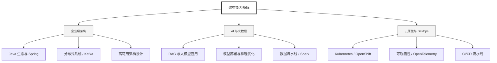

  <h1>你好，我是 Ellen Liu 👋</h1>
  

    <a href="README.md">English</a> | 
    <b>简体中文</b>
  

## 🧠 技术栈与核心能力

智能化企业系统建设路线图，涵盖全栈人工智能工程、云基础设施架构及模型部署等核心技术领域。

```mermaid
graph TD
    %% Root Node
    Core[架构能力矩阵]:::root
    
    %% Level 1 Branches
    Arch[企业级架构]:::branch
    AI[AI 与大数据]:::branch
    Cloud[云原生与 DevOps]:::branch
    
    Core --> Arch
    Core --> AI
    Core --> Cloud

    %% Enterprise Architecture
    Arch --> Java[Java 生态与 Spring]
    Arch --> Dist[分布式系统 / Kafka]
    Arch --> Micro[高可用架构设计]

    %% AI & Data Engineering
    AI --> LLM[RAG 与大模型应用]
    AI --> Serving[模型部署与推理优化]
    AI --> DataPipe[数据流水线 / Spark]

    %% Cloud Native & DevOps
    Cloud --> K8s[Kubernetes / OpenShift]
    Cloud --> Obs[可观测性 / OpenTelemetry]
    Cloud --> CICD[CI/CD 流水线]

    %% Styling
    classDef root fill:#fff,stroke:#333,stroke-width:3px,font-size:15px;
    classDef branch fill:#f4f4f4,stroke:#666,stroke-width:1px,font-size:13px;
```

## 🚀 Highlighted 工作

- **开源 AI 项目**: [基于 BERT 的声明检测模型](https://huggingface.co/XiaojingEllen/bert-finetuned-claim-detection) (Apache-2.0)
  - *已被哥伦比亚大学 (UBC) 研究项目引用。*
  - *手写 Transformer 核心代码，以验证理论与工程的一致性。*
- **金融基础设施**: 从 0 到 1 构建数字银行支付中间件及智能保险理赔系统。

## 📑 每日论文速递 (ArXiv)
<!-- DAILY_ARXIV_SUMMARY_START -->
**更新日期: 2026-08-27**

### 1. [PlanSightRAG：面向土木标准图纸问答与合规检查自动化的视觉优先多模态RAG系统](http://arxiv.org/abs/2608.26091v1)
- **摘要**: 土木基础设施合规性检查长期以来依赖工程师人工阅读传统的二维图纸；然而，基于OCR的自动化方法会剥离解读这些图纸所必需的几何信息和布局结构。我们提出了一种名为PlanSightRAG的视觉优先多模态检索增强生成（RAG）框架。该框架直接对图纸图像进行索引和推理，集成了ColNomic-3B多向量检索、一个智能体化的规划器-检索器-审计器-合成器（Planner-Retriever-Auditor-Synthesizer）流程，以及作为证据链的MaxSim热力图。我们引入了一个包含4,056对样本的基准数据集，该数据集源自五个州交通部（DOT）的标准图纸（共1,898页）。PlanSightRAG在零样本检索中达到了91.47%的Recall@5，而在一个留出的密歇根州交通部语料库上，其Recall@5达到91.40%。在合成、参数化生成的合规性图纸上，我们的Qwen2.5-VL-72B流水线仅在提供预解析规则阈值时达到100%的判定准确率，而一个非VLM的OCR基线在相同条件下已达到76.4%的受控上限。最后，我们通过直接从规范语料库中提取数值限制而无需任何人工提供的规则，展示了自主视觉规则接地能力。

### 2. [SwarmWorld：语言模型代理社会中的痕迹性技术演化](http://arxiv.org/abs/2608.26081v1)
- **摘要**: 集体智慧可以在个体通过共享环境进行协调时涌现，使得局部行动积累成持久的社会组织。语言模型代理为这一过程提供了新的载体，然而大多数多代理系统依赖于直接对话、预设角色或集中式工作流。目前尚不清楚去中心化的代理能否构建功能性技术并超越独立搜索的表现。在此，SwarmWorld中最初同质的LLM代理在没有指定角色或配方的情况下，自组织成不断演进的技术社会。代理探索空间环境、处理资源、测试材料、构建持久性人工制品，并编写可执行控制器，这些控制器在代理被移除后，由确定性模拟器在未见过的扰动下进行评估。SwarmWorld将认知与后果分离：代理在固定的行动和材料模式内提出架构和控制器，而模拟世界则决定功能。共享社会开发出比强大的最佳N个孤立搜索基线更广泛、更具韧性的技术组合，尽管孤立搜索在最强人工制品方面仍具竞争力。代理分化为探索、构建、维护和协调行为，并随着世界的成熟而转变。技术通过协作构建、可执行继承和持久的代理-人工制品网络得以积累，其中大多数重用始于物理观察而非交流。显性文化机制增强了协作和组织，但功能收益取决于结果和时间尺度。仅凭物理痕迹协同就能支持有能力的社会，而交互则驱动持久的技术生态，而非普遍更优的个体发明。

### 3. [LLM数据代理的追踪完整性：面向现实世界系统中可审计结构化推理的愿景](http://arxiv.org/abs/2608.26036v1)
- **摘要**: 答案准确性对于LLM数据代理而言，并非充分的可靠性信号。在结构化数据任务中，基准测试的正确答案可能由无效的追踪过程产生。本文引入了追踪完整性（Trace Integrity）这一部署可靠性标准，用于评估答案背后的计算记录是否明确、可执行、符合模式、忠实于操作符、可重放、与答案一致且可审计。我们识别出“结构差距”（Structure Gap）这一部署失败模式，它使得追踪完整性成为必要：自然语言推理和自由形式的理由说明无法可靠地指定真实世界系统所需的操作符级程序。我们通过执行契约（execution contracts）来具体实现追踪完整性，这些结构化工件将用户意图绑定到模式元素、操作计划、假设、可执行查询、验证状态及最终答案关联。我们还引入了CAIT（正确答案/无效追踪）比率，用于衡量仅基于答案的评估将计算上无支撑的输出视为成功的频率。在BIRD Mini-Dev上的实证演示中，直接SQL、操作摘要+SQL以及契约优先SQL分别实现了20%、22%和24%的答案准确率，而其追踪完整性通过率分别为39%、43%和40%，CAIT比率则居高不下，分别为55%、59.1%和45.8%，这表明答案准确性、追踪有效性和静默失败风险是截然不同的评估信号。因此，现实世界中的LLM数据代理不仅应根据其输出是否与参考答案匹配来评估，还应考虑这些输出是否由可审计的计算过程支撑。

<!-- DAILY_ARXIV_SUMMARY_END -->

## 🌐 保持联系

  
<i>期待与您探讨 AI 基础设施的未来！</i>

