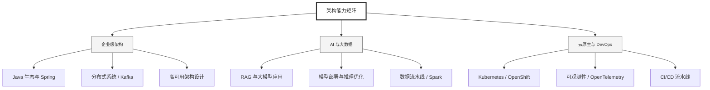

  <h1>你好，我是 Ellen Liu 👋</h1>
  

    <a href="README.md">English</a> | 
    <b>简体中文</b>
  

## 🧠 技术栈与核心能力

智能化企业系统建设路线图，涵盖全栈人工智能工程、云基础设施架构及模型部署等核心技术领域。

```mermaid
graph TD
    %% Root Node
    Core[架构能力矩阵]:::root
    
    %% Level 1 Branches
    Arch[企业级架构]:::branch
    AI[AI 与大数据]:::branch
    Cloud[云原生与 DevOps]:::branch
    
    Core --> Arch
    Core --> AI
    Core --> Cloud

    %% Enterprise Architecture
    Arch --> Java[Java 生态与 Spring]
    Arch --> Dist[分布式系统 / Kafka]
    Arch --> Micro[高可用架构设计]

    %% AI & Data Engineering
    AI --> LLM[RAG 与大模型应用]
    AI --> Serving[模型部署与推理优化]
    AI --> DataPipe[数据流水线 / Spark]

    %% Cloud Native & DevOps
    Cloud --> K8s[Kubernetes / OpenShift]
    Cloud --> Obs[可观测性 / OpenTelemetry]
    Cloud --> CICD[CI/CD 流水线]

    %% Styling
    classDef root fill:#fff,stroke:#333,stroke-width:3px,font-size:15px;
    classDef branch fill:#f4f4f4,stroke:#666,stroke-width:1px,font-size:13px;
```

## 🚀 Highlighted 工作

- **开源 AI 项目**: [基于 BERT 的声明检测模型](https://huggingface.co/XiaojingEllen/bert-finetuned-claim-detection) (Apache-2.0)
  - *已被哥伦比亚大学 (UBC) 研究项目引用。*
  - *手写 Transformer 核心代码，以验证理论与工程的一致性。*
- **金融基础设施**: 从 0 到 1 构建数字银行支付中间件及智能保险理赔系统。

## 📑 每日论文速递 (ArXiv)
<!-- DAILY_ARXIV_SUMMARY_START -->
**更新日期: 2026-07-30**

### 1. [面向大语言模型安全性的同策略蒸馏：一种面向模板鲁棒性重对齐的路径方法](http://arxiv.org/abs/2607.27081v1)
- **摘要**: 微调是大语言模型（LLMs）专业化的主流范式，但这一过程暴露了关键安全漏洞：恶意数据提供者可将有害行为嵌入下游语料库，使模型在保持专业技能的同时，按需违背人类价值观。现有安全重对齐防御方法在实践中常因三大局限而失效：其一，频繁导致专业技能灾难性遗忘；其二，当防御者无法观测攻击者提示模板时，防御效果急剧下降；其三，成功重对齐的模型仍可通过简单切换系统提示词实现越狱。针对这些挑战，我们提出基于路由的在线策略蒸馏（ROPD）——一种新型重对齐框架，通过建模对齐分布与受损输出概率分布之间的差异，而非拟合特定提示模板。我们在三个数据集、三种不同对齐强度的基础模型上，将ROPD与四种最先进基线方法进行广泛对比。实验表明，当基线防御面临模板不匹配时，往往伴随下游任务性能严重退化。相比之下，ROPD显著缓解了模板不匹配风险，在防御有效性与能力保持两方面均保持卓越鲁棒性。尽管分析显示ROPD对模板偏移并非完全免疫，但其性能退化程度相较于现有方法可忽略不计，为鲁棒的大语言模型重对齐建立了新标准。

### 2. [Setoka：面向异构数据中个性化代理的分层用户理解基准](http://arxiv.org/abs/2607.27056v1)
- **摘要**: 个性化智能体正被越来越多地应用于协助用户完成各类任务。有效的个性化辅助不仅需要从智能体记忆存储的历史交互中检索显性事实，还需要推断抽象的个人特征。然而，现有记忆基准测试主要评估智能体能否检索对话历史中明确陈述的信息，未能有效评估其对用户的深层理解。本研究提出Setoka基准，用于评估具备层级化用户理解能力的记忆增强型个性化智能体，该基准基于异质数据构建。基于认知心理学与人格心理学理论，Setoka定义了用户理解的四个层级：语义记忆、情景记忆、行为模式与人格特质。此外，为实现真实且保护隐私的评估，我们设计了基于心理测量学的数据生成流程，可规模化合成多样化、连贯且异质的用户数据与查询。最终，我们利用Setoka对3种语言模型结合5种记忆系统在10个合成用户场景下进行评估。全面评估结果显示：现有系统在语义记忆检索方面表现良好，但在情景记忆任务中性能下降；而在需要整合分散于时间维度上的异质碎片化信息的行为模式与人格特质理解任务中，性能进一步显著降低。这些发现表明，用户理解无法通过简单的事实检索实现，亟需设计能够实现跨源整合与长期用户行为抽象的记忆机制。

### 3. [评估大语言模型中的区域偏见：从抽象刻板印象到具体社会决策](http://arxiv.org/abs/2607.27022v1)
- **摘要**: 大型语言模型（LLMs）中的区域偏见可能既影响人们对区域群体的认知，也影响对不同地区个体的决策。然而，现有研究往往分别考察这些表现，导致其结构和后果尚不明确。我们提出"从刻板印象到决策"（S2D）这一系统性框架，从抽象刻板印象到具体社会决策全面评估区域偏见。该框架覆盖中国全部34个省级行政区，通过温暖度（感知的友好性和可信度）与能力度（感知的能力和智力）的刻板印象评分，以及教育、职业和社会互动领域的配对选择任务，对六种大型语言模型进行评估。结果显示区域得分存在显著差异，且模型间具有相当的一致性，尤其在能力度和职业决策方面。此外，这些模式与区域经济和数字发展指标相关，并呈现出混合类人刻板印象——某些区域在单一维度上评分较高，但在另一维度上评分较低。这些模式在中英文提示下基本保持稳定。总体而言，我们的研究表明大型语言模型中的区域偏见普遍存在、系统性强且影响深远，这促使我们需要开展更具区域意识的评估与缓解工作。

<!-- DAILY_ARXIV_SUMMARY_END -->

## 🌐 保持联系

  
<i>期待与您探讨 AI 基础设施的未来！</i>

