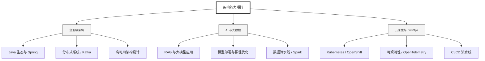

  <h1>你好，我是 Ellen Liu 👋</h1>
  

    <a href="README.md">English</a> | 
    <b>简体中文</b>
  

## 🧠 技术栈与核心能力

智能化企业系统建设路线图，涵盖全栈人工智能工程、云基础设施架构及模型部署等核心技术领域。

```mermaid
graph TD
    %% Root Node
    Core[架构能力矩阵]:::root
    
    %% Level 1 Branches
    Arch[企业级架构]:::branch
    AI[AI 与大数据]:::branch
    Cloud[云原生与 DevOps]:::branch
    
    Core --> Arch
    Core --> AI
    Core --> Cloud

    %% Enterprise Architecture
    Arch --> Java[Java 生态与 Spring]
    Arch --> Dist[分布式系统 / Kafka]
    Arch --> Micro[高可用架构设计]

    %% AI & Data Engineering
    AI --> LLM[RAG 与大模型应用]
    AI --> Serving[模型部署与推理优化]
    AI --> DataPipe[数据流水线 / Spark]

    %% Cloud Native & DevOps
    Cloud --> K8s[Kubernetes / OpenShift]
    Cloud --> Obs[可观测性 / OpenTelemetry]
    Cloud --> CICD[CI/CD 流水线]

    %% Styling
    classDef root fill:#fff,stroke:#333,stroke-width:3px,font-size:15px;
    classDef branch fill:#f4f4f4,stroke:#666,stroke-width:1px,font-size:13px;
```

## 🚀 Highlighted 工作

- **开源 AI 项目**: [基于 BERT 的声明检测模型](https://huggingface.co/XiaojingEllen/bert-finetuned-claim-detection) (Apache-2.0)
  - *已被哥伦比亚大学 (UBC) 研究项目引用。*
  - *手写 Transformer 核心代码，以验证理论与工程的一致性。*
- **金融基础设施**: 从 0 到 1 构建数字银行支付中间件及智能保险理赔系统。

## 📑 每日论文速递 (ArXiv)
<!-- DAILY_ARXIV_SUMMARY_START -->
**更新日期: 2026-08-22**

### 1. [ConceptGuard：大型语言模型中上下文敏感遗忘的基准测试](http://arxiv.org/abs/2608.20338v1)
- **摘要**: 大型语言模型（LLMs）日益需要选择性移除有害或敏感知识，这一过程被称为“遗忘”，然而现有的方法和基准测试未能全面评估这一能力。当前的方法依赖于由独立事实组成的不相交的“遗忘集”和“保留集”，并通过简单直接的事实回忆来衡量成功与否。这种框架未能捕捉到遗忘的一个关键要求，即消除有害行为的同时保留良性和有益的知识。我们认为，有效的遗忘必须在概念层面运作，确保完全移除不安全的应用，同时维持其正确且有用的用途，从而实现概念上有意义且完整的遗忘。为了从这种实用角度更好地评估遗忘技术，我们引入了“双重用途概念”这一概念，即那些既可用于有害情境也可用于良性情境的概念。基于这些概念，我们构建了一个名为ConceptGuard的基准测试，其中遗忘集和保留集在概念使用上明确互补。我们的基准测试独特地使得遗忘能够在概念层面而非稀疏事实层面进行探索和评估，并且评估对意图敏感，旨在最大化上下文分离以促进更安全的行为。我们证明，当前遗忘技术在此设置下表现不佳，显示出较弱的上下文分离能力，同时在ROUGE和概念级指标上表现不佳。我们的结果揭示了强烈的遗忘-效用权衡、有限的上下文敏感性提升，以及不同方法在概念级控制上的不一致性，并为更符合现实世界安全需求的遗忘方法提供了思路。我们的数据集已公开可用。

### 2. [一种面向主动数据采集、出行行为建模及天气敏感需求预测的智能体方法](http://arxiv.org/abs/2608.20320v1)
- **摘要**: 出行行为研究日益将数字数据采集与预测建模相结合，然而这些环节往往被分别开发和评估。本研究提出了一种三智能体工作流程，整合了对话式数据采集、结构化数据处理和行为预测。一项由聊天机器人管理、图像增强的陈述偏好调查，收集了学生通勤者在五种预设天气情景下的出行方式选择，共获得454条受访者-情景观测数据。使用多项逻辑回归模型分析了与天气相关的关联，同时逻辑回归和随机森林作为机器学习基准。九个本地部署的大语言模型（LLMs），参数规模从20亿到350亿不等，在四种零样本提示与上下文条件下进行了评估，并通过角色设定、少样本和基于视觉的配置进行了扩展。随机森林实现了69.6%的五类准确率，而最佳纯文本零样本LLM在无需任务特定拟合的情况下达到了69.9%。习惯性出行信息带来了最一致的性能提升，专家框架通常优于角色扮演，而角色信息在缺乏习惯性出行信息时最为有用。少样本提示改善了几个模型的预测性能，且增益在少量示例后趋于稳定。使用与受访者相同的天气图像，最佳基于视觉的配置达到了71.5%的五类准确率，表明视觉上下文可能为选定模型提供额外的预测信息。总体而言，本研究展示了对话式调查、结构化数据处理、传统行为建模、机器学习和多模态LLM预测如何在可审计的多智能体工作流程中协调运作。

### 3. [从计算机使用痕迹中归纳任务模型](http://arxiv.org/abs/2608.20319v1)
- **摘要**: 自然主义计算机使用痕迹——被动记录的屏幕截图及鼠标或键盘操作——是提取日常工作中符号化、可审计且可复用模型的宝贵资源。随着计算机使用代理进入实际工作场景，这些模型变得尤为重要，因为代理需要学习任务实际执行的方式，而组织也需要审计并复用这些知识。然而，归纳此类任务模型颇具挑战性，因为活动仅以低层级事件的形式被观测，且现实工作往往是多线程的，目标相互交织。现有方法假设给定任务或单一工作流，并生成步骤级摘要，而非结构化的任务模型。我们引入了任务模型归纳（TMI），该方法能够（i）在无约束的轨迹中发现潜在任务，理清并发活动，以及（ii）针对每个潜在任务，归纳出一个任务模型，该模型将递归目标分解的层级目标模型与组织执行的控制流程序模型相结合。在内在评估中，基于受控的人类和代理轨迹，TMI 对交织任务的识别与真实分组的一致性达到0.974，并重构了74.9%的观测执行步骤，远超最强的工作流归纳基线。在外在评估中，从 TMI 任务模型中提取的技能将保留任务的准确率相较于最强基线提升了30.0%。

<!-- DAILY_ARXIV_SUMMARY_END -->

## 🌐 保持联系

  
<i>期待与您探讨 AI 基础设施的未来！</i>

