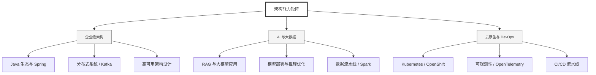

  <h1>你好，我是 Ellen Liu 👋</h1>
  

    <a href="README.md">English</a> | 
    <b>简体中文</b>
  

## 🧠 技术栈与核心能力

智能化企业系统建设路线图，涵盖全栈人工智能工程、云基础设施架构及模型部署等核心技术领域。

```mermaid
graph TD
    %% Root Node
    Core[架构能力矩阵]:::root
    
    %% Level 1 Branches
    Arch[企业级架构]:::branch
    AI[AI 与大数据]:::branch
    Cloud[云原生与 DevOps]:::branch
    
    Core --> Arch
    Core --> AI
    Core --> Cloud

    %% Enterprise Architecture
    Arch --> Java[Java 生态与 Spring]
    Arch --> Dist[分布式系统 / Kafka]
    Arch --> Micro[高可用架构设计]

    %% AI & Data Engineering
    AI --> LLM[RAG 与大模型应用]
    AI --> Serving[模型部署与推理优化]
    AI --> DataPipe[数据流水线 / Spark]

    %% Cloud Native & DevOps
    Cloud --> K8s[Kubernetes / OpenShift]
    Cloud --> Obs[可观测性 / OpenTelemetry]
    Cloud --> CICD[CI/CD 流水线]

    %% Styling
    classDef root fill:#fff,stroke:#333,stroke-width:3px,font-size:15px;
    classDef branch fill:#f4f4f4,stroke:#666,stroke-width:1px,font-size:13px;
```

## 🚀 Highlighted 工作

- **开源 AI 项目**: [基于 BERT 的声明检测模型](https://huggingface.co/XiaojingEllen/bert-finetuned-claim-detection) (Apache-2.0)
  - *已被哥伦比亚大学 (UBC) 研究项目引用。*
  - *手写 Transformer 核心代码，以验证理论与工程的一致性。*
- **金融基础设施**: 从 0 到 1 构建数字银行支付中间件及智能保险理赔系统。

## 📑 每日论文速递 (ArXiv)
<!-- DAILY_ARXIV_SUMMARY_START -->
**更新日期: 2026-07-31**

### 1. [公平性剪枝：通过差分激活定位GLU-MLP层中的群体偏差](http://arxiv.org/abs/2607.28319v1)
- **摘要**: 本文提出了公平性剪枝（Fairness Pruning），一种轻量级结构性干预方法，旨在管理和未来缓解大型语言模型（LLMs）中的人口统计偏见。作为该方法的初步实证验证，本文聚焦于因果性偏见定位。通过使用最小对比提示对和推理时激活捕获，该方法识别出在GLU架构中处理人口统计属性时反应差异化的神经元，并在down_proj输入处评估信号。实证评估在高达30亿参数的模型（Llama-3.2系列和Salamandra-2B）上进行，结合了标准化基准评估与定性文本生成实验。结果表明，将识别出的神经元置零会改变模型对相关人口统计变量的响应方式。然而，干预并未产生平坦的缓解效果，而是导致双向偏见不稳定化：由于BiasScore是无符号的，候选集混合了推动和对抗刻板印象的神经元，对总体偏见的净效应取决于哪种符号占主导。该干预极具精准性：在Llama-3.2-1B中最多置零40个神经元（不到总MLP宽度的0.031%），即可在推理和通用知识能力上实现99.49%的平均保留率。这些发现实证确认了人口统计偏见处理与模型能力在可分离电路上运行，为从盲目置零转向定向行为调节奠定了方法论基础。

### 2. [CACHE-UK：面向金融领域顺序更新量化大语言模型的稳定性感知内存编辑器](http://arxiv.org/abs/2607.28292v1)
- **摘要**: 部署于动态金融环境中的大型语言模型（LLMs）面临一项关键挑战：在市场条件、法规及企业事实持续变化的情况下，保持事实准确性。尽管4比特量化能够实现高效部署，但它严重限制了顺序记忆编辑的可行性：现有方法在此“量化稳定性危机”下会遭受灾难性的性能退化。我们提出CACHE-UK（面向英国金融的情境自适应持续混合编辑器），这是一种专为领域特定、量化LLMs设计的稳定性感知记忆编辑框架。CACHE-UK整合了三个组件：一种秩-1 LoRA扰动机制，将编辑限制在低秩适配器子空间内；一个金融领域优先级模块，用于内容自适应的编辑强度；以及一个闭环稳定性控制器，追踪“退化债务”以防止跨顺序更新的灾难性遗忘。在基于4比特量化的OpenLLaMA-3B模型及包含88,021份文档的精选英国金融语料库上评估，CACHE-UK在相同的4比特约束下，相较于适配基线，将知识退化降低了11-17%——这是其最显著的效果——同时实现了我们设置中观察到的最高测试成功率（泛化率）（28%，比最强适配基线高出6个百分点）。这些结果表明，稳定性感知编辑能够改善资源受限金融LLM部署中的事实维护，尽管绝对泛化率仍然较低。

### 3. [（迈向）基于大型语言模型的可扩展、可靠自动化评估](http://arxiv.org/abs/2607.28282v1)
- **摘要**: 评估大型语言模型（LLMs）文本输出的质量和相关性仍然是一项具有挑战性且资源密集的任务。现有的自动化指标往往无法捕捉LLM生成输出中固有的复杂性和多变性。此外，这些指标通常依赖于明确的参考标准，限制了其在具有客观基准的领域中的使用。本研究引入了一种新颖的评估框架，旨在近似专家级对LLM生成内容的评估。所提出的方法采用多个LLM对输出进行成对比较，以减少单个模型带来的偏差。使用Elo评分系统生成稳定且可解释的排名。可调的协议阈值，从完全一致到多数投票，允许对评估置信度和覆盖范围进行灵活控制。该方法的有效性通过评估从科学摘要中提取的能力概况得到验证。初步结果表明，自动生成的排名与专家判断高度相关，显著减少了对大量人工干预的需求。通过提供可扩展、一致且领域无关的评估层，该框架支持对LLM输出在各种应用中更高效、更可靠的质量评估。

<!-- DAILY_ARXIV_SUMMARY_END -->

## 🌐 保持联系

  
<i>期待与您探讨 AI 基础设施的未来！</i>

