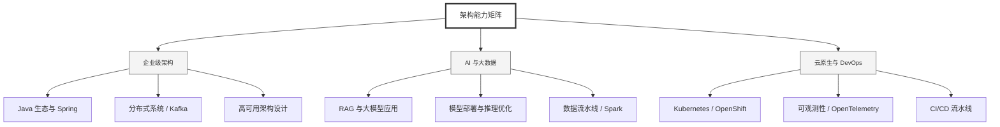

  <h1>你好，我是 Ellen Liu 👋</h1>
  

    <a href="README.md">English</a> | 
    <b>简体中文</b>
  

## 🧠 技术栈与核心能力

智能化企业系统建设路线图，涵盖全栈人工智能工程、云基础设施架构及模型部署等核心技术领域。

```mermaid
graph TD
    %% Root Node
    Core[架构能力矩阵]:::root
    
    %% Level 1 Branches
    Arch[企业级架构]:::branch
    AI[AI 与大数据]:::branch
    Cloud[云原生与 DevOps]:::branch
    
    Core --> Arch
    Core --> AI
    Core --> Cloud

    %% Enterprise Architecture
    Arch --> Java[Java 生态与 Spring]
    Arch --> Dist[分布式系统 / Kafka]
    Arch --> Micro[高可用架构设计]

    %% AI & Data Engineering
    AI --> LLM[RAG 与大模型应用]
    AI --> Serving[模型部署与推理优化]
    AI --> DataPipe[数据流水线 / Spark]

    %% Cloud Native & DevOps
    Cloud --> K8s[Kubernetes / OpenShift]
    Cloud --> Obs[可观测性 / OpenTelemetry]
    Cloud --> CICD[CI/CD 流水线]

    %% Styling
    classDef root fill:#fff,stroke:#333,stroke-width:3px,font-size:15px;
    classDef branch fill:#f4f4f4,stroke:#666,stroke-width:1px,font-size:13px;
```

## 🚀 Highlighted 工作

- **开源 AI 项目**: [基于 BERT 的声明检测模型](https://huggingface.co/XiaojingEllen/bert-finetuned-claim-detection) (Apache-2.0)
  - *已被哥伦比亚大学 (UBC) 研究项目引用。*
  - *手写 Transformer 核心代码，以验证理论与工程的一致性。*
- **金融基础设施**: 从 0 到 1 构建数字银行支付中间件及智能保险理赔系统。

## 📑 每日论文速递 (ArXiv)
<!-- DAILY_ARXIV_SUMMARY_START -->
**更新日期: 2026-08-08**

### 1. [工具调用的苦涩教训](http://arxiv.org/abs/2608.06370v1)
- **摘要**: 工具使用将大语言模型（LLM）转变为能够超越其训练数据行动的智能体，而对于具备代码能力的模型，程序化工具调用进一步扩展了这一能力，通过用自然链式调用和并行化的脚本取代僵化的JSON调用。然而，在既有基准测试上，针对当前及先前模型代际，在真实任务条件下对“工具即代码”的系统性评估尚未开展。在本研究中，我们在BFCL v4上对14种语言模型进行了程序化工具调用（PTC）与原生JSON工具调用的实证比较。在程序化工具调用范式中，工具以类型化的Python存根形式暴露，模型通过代码调用这些工具，执行和结果处理在单个智能体回合内完成。在BFCL v4上，程序化工具调用在14个模型中的11个上达到或超越了原生JSON工具调用的性能，其中GPT-5.6系列相较于JSON工具调用基线提升了10.6%。此外，在并行扇出条件下，它在14个模型中的13个上达到或优于基线，并在上下文退化条件下保持稳定，而基线平均退化2.3%。我们的结果表明，程序化工具调用是JSON工具调用的可行且稳健的替代方案，其性能随发布代际的模型能力变化而同步提升。

### 2. [AV-AIVAT：在不完美信息博弈中，实现认证的任意时间有效停止，将智能体评估成本降低74倍](http://arxiv.org/abs/2608.06362v1)
- **摘要**: 判断两个智能体孰强孰弱，需要持续进行对局，直到技巧的作用超过运气的影响，而每局游戏都耗费资金、模型推理或专家时间。由于所需对局数量未知，固定预算的评估要么在结果已明朗后仍继续投入，要么在智能体差异尚无法分辨时便提前终止；而采用普通置信区间的朴素可选停止法则则会破坏既定的显著性水平。我们让此类评估在证据充分的那一刻即刻停止，同时保证统计保证不受影响。行动知情价值评估工具（AIVAT）通过条件均值零修正，在非完美信息博弈中降低方差，在涵盖71,439手配对单挑无限注德州扑克（HUNL）的15种LLM智能体配置中，方差降低中位数达$54\times$，但该工具并未说明何时应停止。我们将AIVAT与持续监测的置信序列（CSs）相结合，提出随时有效的AIVAT（AV-AIVAT），其在线价值模型仅从过往对局中学习，确保任何一局游戏都不会对自己的修正进行评分。在名义95%置信水平及$\pm1$大盲注的目标精度下，原始结果在渐近置信序列（AsympCS）下停止所需的手数中位数是经AIVAT修正结果的$74\times$。精确的有限样本认证采用经验-伯恩斯坦置信序列（EB-CS），该序列需要对修正后收益有一个独立验证的界。我们针对Leduc德州扑克从结构上建立了这样的界，并刻画了由CS的赌注上限及该界共同决定的宽度下限，该下限决定了方差缩减中有多少能转化为更早的停止；描述性的HUNL EB-CS运行结果显示，停止时间比的中位数为$1.37\times$。AV-AIVAT将方差缩减转化为高效、可审计的早期停止，同时将渐近筛选与精确认证相分离，使评估能在证据充分的那一刻立即停止，并向第三方提供在那一停止时刻重新核查结论所需的一切信息。

### 3. [CalibForge：面向可学习终端任务扩展的对抗性求解器校准](http://arxiv.org/abs/2608.06352v1)
- **摘要**: 训练终端智能体需要可执行且可验证的任务，这些任务不仅需可解，还须对学习过程具有恰当的挑战性。可执行验证确立了可行性，却未揭示任务在特定求解器设置下的行为表现。本文提出CalibForge，一种自主终端任务合成系统，利用经过验证的求解器行为，通过对抗性求解器校准来修订候选任务。多求解器校准针对异构求解器池内的分歧，而对比求解器校准则针对指定的强通过/弱失败关系；两者均将基于已证明可解性的求解器相对可学习区域操作化。利用CalibForge，我们构建了5,431个校准终端任务。我们的消融实验表明，这两种策略比仅依赖创作与验证或普通单求解器反馈提供了更有效的监督信号。基于完整集合训练的模型在Terminal-Bench 2.0上分别达到32.58%和47.57%的准确率。相较于对应基础模型的最大提升在Terminal-Bench 2.0上达到24.71个百分点，在SWE-bench Pro上提升27.68个百分点，在Doc2Repo上提升30.04个百分点。综合来看，这些结果支持将求解器相对可学习性作为构建有效且可迁移智能体训练数据的实用目标。

<!-- DAILY_ARXIV_SUMMARY_END -->

## 🌐 保持联系

  
<i>期待与您探讨 AI 基础设施的未来！</i>

