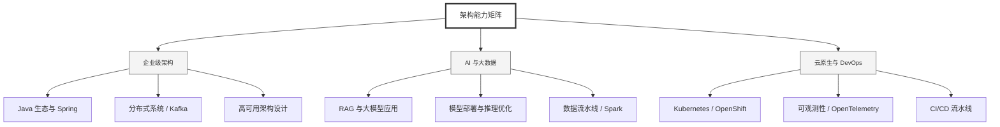

  <h1>你好，我是 Ellen Liu 👋</h1>
  

    <a href="README.md">English</a> | 
    <b>简体中文</b>
  

## 🧠 技术栈与核心能力

智能化企业系统建设路线图，涵盖全栈人工智能工程、云基础设施架构及模型部署等核心技术领域。

```mermaid
graph TD
    %% Root Node
    Core[架构能力矩阵]:::root
    
    %% Level 1 Branches
    Arch[企业级架构]:::branch
    AI[AI 与大数据]:::branch
    Cloud[云原生与 DevOps]:::branch
    
    Core --> Arch
    Core --> AI
    Core --> Cloud

    %% Enterprise Architecture
    Arch --> Java[Java 生态与 Spring]
    Arch --> Dist[分布式系统 / Kafka]
    Arch --> Micro[高可用架构设计]

    %% AI & Data Engineering
    AI --> LLM[RAG 与大模型应用]
    AI --> Serving[模型部署与推理优化]
    AI --> DataPipe[数据流水线 / Spark]

    %% Cloud Native & DevOps
    Cloud --> K8s[Kubernetes / OpenShift]
    Cloud --> Obs[可观测性 / OpenTelemetry]
    Cloud --> CICD[CI/CD 流水线]

    %% Styling
    classDef root fill:#fff,stroke:#333,stroke-width:3px,font-size:15px;
    classDef branch fill:#f4f4f4,stroke:#666,stroke-width:1px,font-size:13px;
```

## 🚀 Highlighted 工作

- **开源 AI 项目**: [基于 BERT 的声明检测模型](https://huggingface.co/XiaojingEllen/bert-finetuned-claim-detection) (Apache-2.0)
  - *已被哥伦比亚大学 (UBC) 研究项目引用。*
  - *手写 Transformer 核心代码，以验证理论与工程的一致性。*
- **金融基础设施**: 从 0 到 1 构建数字银行支付中间件及智能保险理赔系统。

## 📑 每日论文速递 (ArXiv)
<!-- DAILY_ARXIV_SUMMARY_START -->
**更新日期: 2026-09-20**

### 1. [具有障碍物感知约束框架的编码智能体用于安全机器人操作](http://arxiv.org/abs/2609.20822v1)
- **摘要**: 编码智能体已成为机器人操作领域一种颇具前景的范式：语言模型将机器人控制器编写为程序，以这种方式构建的智能体现在无需针对机器人专门训练即可操作机器人。然而，这一范式是否同样安全，尚未有人追问。我们在安全约束下评估编码智能体，其中每项任务将一个操作目标与一个机器人不得触碰的障碍物配对。智能体追求目标，但在大多数情况下会与障碍物发生碰撞，将任务完成视为唯一目标而忽视安全。智能体在其推理轨迹中考虑了障碍物，提示词也已禁止触碰它，因此问题既不在感知也不在指令；问题出在规划上，所述约束从未成为优先事项。通过将操作分解为路径阶段和接触密集时刻，我们定位了失败的根源。在路径上，模型无法将安全约束置于优先地位，因为它既没有畅通路径的概念，也没有在所选路径变得不可行时重新规划的概念。在接触时，它没有意识到接触执行同样受该约束的限制。为弥合这一差距，我们提出SafeHarness，它为模型配备了两个障碍物感知工具，使其能够将安全约束置于优先地位。障碍物感知路径规划将物体作为边界框进行定位，并在其上以路点序列的形式绘制候选路径。随后，智能体提前规划路径、验证路径、在必要时重新规划，然后才执行。障碍物感知接触执行则选择接触位置，使接触本身避开障碍物。SafeHarness实现了71.9%的任务成功率和87.5%的碰撞避免率，分别超越此前最先进水平6.5%和27.0%。这些结果分别是同一智能体在无工具情况下的2.3倍和1.5倍。

### 2. [编码智能体框架设计的实证研究](http://arxiv.org/abs/2609.20804v1)
- **摘要**: 编码框架决定了自主编码智能体如何将模型能力转化为长周期软件工程表现，但现有工作通常将框架作为整体系统进行评估，导致各独立组件的有效性尚不明确。为实现组件级比较，我们采用一个轻量级编码框架来研究这一问题，该框架的执行循环固定不变，同时变化三个组件：规划、动作空间和上下文管理。在四个模型上，基于SWE-Bench Verified和Terminal-Bench 2.1进行评估，我们评测了176个匹配设置，涵盖五种上下文管理策略、四种上下文窗口预算，以及针对规划和动作空间的有针对性消融。我们发现：(1) 随着上下文窗口预算收紧，上下文管理的价值日益凸显，其大部分收益来自防止上下文溢出失败。(2) 在基于LLM的摘要之前先进行基于规则的省略，在上下文管理策略中提供了最强的整体效率，而让被省略内容可恢复则增加了模型很少使用的机制，且未带来准确率提升。(3) 规划从较弱模型的准确率支架转变为较强模型的成本节约手段，准确率变化不大。(4) 预定义工具提升了bash能力较弱模型的表现，而具备bash能力的模型可以仅通过bash接口有效运行，并实现显著更低的成本，尤其是在以命令行为中心的任务上。轨迹级分析解释了这些效应：上下文管理延长了执行轨迹，而未实质性改变智能体行为；规划改变了轨迹停止的位置；动作空间改变了代码编写的粒度。这些发现为模型和预算感知的框架设计提供了依据，并为评估未来框架组件提供了一个模块化框架。

### 3. [RetireOPD：面向智能体强化学习的自退役同策略蒸馏](http://arxiv.org/abs/2609.20784v1)
- **摘要**: 使用强化学习（RL）训练的多轮智能体每条轨迹仅接收一个标量奖励，这促使了自同策略蒸馏（OPD）的出现，即由一个具备特权任务技能的自教师模型提供密集的词元级监督，让无技能的学生模型将其内化。然而，这一方案在智能体任务中被两项发现所削弱：仅有特权信息并不总能使教师模型可靠，且教师监督的收益具有阶段依赖性。因此，我们提出RetireOPD（自退役同策略蒸馏），它首先利用环境奖励优化一个解耦的技能条件教师模型，然后通过RL与OPD联合训练一个无技能的学生模型。RetireOPD不遵循预定义的蒸馏计划，而是采用自适应退役：一旦学生模型与教师模型之间的差异不再缩小，且学生模型达到教师模型成功率的目分比，学生模型便自行放弃教师模型，此后仅以RL继续训练。在Qwen2.5系列1.5B至7B模型上，RetireOPD将ALFWorld成功率较RL基线提升14.1%至18.8%，WebShop准确率提升11.8%至19.0%，并在所有设置下超越其自身的技能条件教师模型。

<!-- DAILY_ARXIV_SUMMARY_END -->

## 🌐 保持联系

  
<i>期待与您探讨 AI 基础设施的未来！</i>

