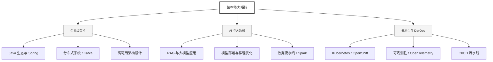

  <h1>你好，我是 Ellen Liu 👋</h1>
  

    <a href="README.md">English</a> | 
    <b>简体中文</b>
  

## 🧠 技术栈与核心能力

智能化企业系统建设路线图，涵盖全栈人工智能工程、云基础设施架构及模型部署等核心技术领域。

```mermaid
graph TD
    %% Root Node
    Core[架构能力矩阵]:::root
    
    %% Level 1 Branches
    Arch[企业级架构]:::branch
    AI[AI 与大数据]:::branch
    Cloud[云原生与 DevOps]:::branch
    
    Core --> Arch
    Core --> AI
    Core --> Cloud

    %% Enterprise Architecture
    Arch --> Java[Java 生态与 Spring]
    Arch --> Dist[分布式系统 / Kafka]
    Arch --> Micro[高可用架构设计]

    %% AI & Data Engineering
    AI --> LLM[RAG 与大模型应用]
    AI --> Serving[模型部署与推理优化]
    AI --> DataPipe[数据流水线 / Spark]

    %% Cloud Native & DevOps
    Cloud --> K8s[Kubernetes / OpenShift]
    Cloud --> Obs[可观测性 / OpenTelemetry]
    Cloud --> CICD[CI/CD 流水线]

    %% Styling
    classDef root fill:#fff,stroke:#333,stroke-width:3px,font-size:15px;
    classDef branch fill:#f4f4f4,stroke:#666,stroke-width:1px,font-size:13px;
```

## 🚀 Highlighted 工作

- **开源 AI 项目**: [基于 BERT 的声明检测模型](https://huggingface.co/XiaojingEllen/bert-finetuned-claim-detection) (Apache-2.0)
  - *已被哥伦比亚大学 (UBC) 研究项目引用。*
  - *手写 Transformer 核心代码，以验证理论与工程的一致性。*
- **金融基础设施**: 从 0 到 1 构建数字银行支付中间件及智能保险理赔系统。

## 📑 每日论文速递 (ArXiv)
<!-- DAILY_ARXIV_SUMMARY_START -->
**更新日期: 2026-09-17**

### 1. [LLM偏好对齐的零阶范式](http://arxiv.org/abs/2609.19144v1)
- **摘要**: 直接偏好对齐方法因其计算和内存效率而被广泛用于使大语言模型（LLM）与人类偏好对齐。然而，似然位移促使人们寻求从具有小似然边际的偏好对中提取信息的替代方法。本文提出并分析了基于比较的偏好优化（ComPO），一种基于比较预言机的零阶对齐方法。ComPO从这些偏好对中提取方向信息，而不直接在其上优化可微的偏好损失。我们在平滑性、梯度稀疏性以及预言机与潜在目标之间兼容性的条件下，为其基本离线方案建立了收敛保证。我们进一步引入了在线ComPO，它保留离线比较机制，并使用未标注的策略生成进行相对于参考策略的反向KL控制。遵循偏好微调的覆盖视角，我们在局部覆盖和分布内成对奖励准确性的条件下，为一个基本约束方案建立了性能保证。在Mistral、Llama、Gemma-2、Qwen3和Gemma-3模型上的实验表明，该方法优于现有的直接对齐方法，包括长度控制的胜率，且成对层面的诊断提供了与缓解似然位移相一致的证据。

### 2. [ScienceIDE：将全球科学代码库转化为智能体可学习环境](http://arxiv.org/abs/2609.19134v1)
- **摘要**: 科学代码仓库将数十年的人类知识编码为可执行的模型、方法和工具。然而，碎片化的工具链、隐式的领域约定以及专门化的正确性标准，使这些知识难以转化为可靠的学习经验——我们将这一挑战称为科学经验瓶颈。我们提出ScienceIDE，这是一种将全球科学代码转化为科学智能体可编程环境的基础设施。在专家定义的科学案例和验收标准的指导下，智能体将代码仓库转化为可执行环境，以支持任务生成、执行和科学验证。这些环境为监督微调、强化学习和评估提供了共享基础。利用经过验证的交互轨迹，我们训练了PhAI-IDE-72B、PhAI-IDE-9B和PhAI-IDE-4B。该模型系列在留出的科学代码修复任务以及代码、推理和知识领域的若干选定通用基准上均表现出提升，为科学经验向更广泛能力的正向迁移提供了证据。ScienceIDE为智能体学习与科学实践的一体化工作空间奠定了基础，使人类的科学软件成为发展科学智能的共享基座。代码：https://github.com/aitofound/ScienceIDE

### 3. [在维基百科摘要上玩对数(N)问题：配对前沿模型间的通信效率](http://arxiv.org/abs/2609.19113v1)
- **摘要**: 我们在双智能体$\log(N)$问题游戏中评估了六个前沿语言模型。提问者看到$N$个维基百科导言段落，必须恰好用$\log_2 N$个是/否问题找出秘密选定的目标。回答者只看到目标和问题，并用一个词作答。两个角色由同一提供商运行，因此该游戏衡量的是模型在信息不对称条件下与自身沟通的效果。我们在4到1024个段落的文档集上运行了408局游戏，总API成本为363美元。一个模型明显落后于其他模型：Claude Opus 5在68局中赢了28局，而GLM-5.3、GPT-5.6 Sol、Grok 4.6、Gemini 3.8 Flash和Kimi K3则赢了45到56局。领先的五个模型之间仅能勉强区分。将这五个模型合并后，胜率随集合大小下降，$r=-0.973$，并可由单个每轮可靠性参数拟合。其形式为$\text{win}=p^{\log_2 N}$，其中$p=0.928$。失败大致均等地分为答案错误和区分失败，并且模型几乎从不会说出其自身证据所排除的文档。对最弱模型的每一个一致答案错误都进行了检查：34个中有32个是“No”答案，针对的是文档第一句中陈述的属性，而且是在明确警告不要默认回答“No”的指令下。根据答案平衡估计的每个问题的信息量与胜率的相关性为$r=+0.88$。仅有的两个能从每个问题中提取完整比特的模型，也是仅有的两个按文档标题进行划分的模型；这种策略在$N{=}32$以下不存在，而在其以上用于四分之一的问题中。推理token支出在不同模型之间相差$4.5\times$，与成功关系不大，并且随着候选集缩小，轨迹会增长，但可靠性没有相应提升。

<!-- DAILY_ARXIV_SUMMARY_END -->

## 🌐 保持联系

  
<i>期待与您探讨 AI 基础设施的未来！</i>

