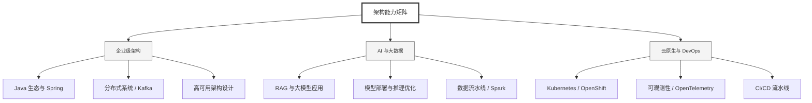

  <h1>你好，我是 Ellen Liu 👋</h1>
  

    <a href="README.md">English</a> | 
    <b>简体中文</b>
  

## 🧠 技术栈与核心能力

智能化企业系统建设路线图，涵盖全栈人工智能工程、云基础设施架构及模型部署等核心技术领域。

```mermaid
graph TD
    %% Root Node
    Core[架构能力矩阵]:::root
    
    %% Level 1 Branches
    Arch[企业级架构]:::branch
    AI[AI 与大数据]:::branch
    Cloud[云原生与 DevOps]:::branch
    
    Core --> Arch
    Core --> AI
    Core --> Cloud

    %% Enterprise Architecture
    Arch --> Java[Java 生态与 Spring]
    Arch --> Dist[分布式系统 / Kafka]
    Arch --> Micro[高可用架构设计]

    %% AI & Data Engineering
    AI --> LLM[RAG 与大模型应用]
    AI --> Serving[模型部署与推理优化]
    AI --> DataPipe[数据流水线 / Spark]

    %% Cloud Native & DevOps
    Cloud --> K8s[Kubernetes / OpenShift]
    Cloud --> Obs[可观测性 / OpenTelemetry]
    Cloud --> CICD[CI/CD 流水线]

    %% Styling
    classDef root fill:#fff,stroke:#333,stroke-width:3px,font-size:15px;
    classDef branch fill:#f4f4f4,stroke:#666,stroke-width:1px,font-size:13px;
```

## 🚀 Highlighted 工作

- **开源 AI 项目**: [基于 BERT 的声明检测模型](https://huggingface.co/XiaojingEllen/bert-finetuned-claim-detection) (Apache-2.0)
  - *已被哥伦比亚大学 (UBC) 研究项目引用。*
  - *手写 Transformer 核心代码，以验证理论与工程的一致性。*
- **金融基础设施**: 从 0 到 1 构建数字银行支付中间件及智能保险理赔系统。

## 📑 每日论文速递 (ArXiv)
<!-- DAILY_ARXIV_SUMMARY_START -->
**更新日期: 2026-08-11**

### 1. [《CreativeInstruct：规模化教导大语言模型平衡质量、创造力与多样性》](http://arxiv.org/abs/2608.07460v1)
- **摘要**: 虽然后训练（post-training）能提升大型语言模型（LLMs）的能力，但通常会降低其输出多样性和创造力，这对明确需要创造力的任务（如故事生成）以及隐含需要创造力的任务（如强化学习，RL）产生负面影响。为此，我们提出CreativeInstruct，一种可扩展的指令调优方法，通过教导LLMs在生成中注入特殊的[StartCreativity]跨度（span），以平衡基础模型般的创造性生成与后训练模型的质量。此外，我们引入一种基于图编辑距离的结构多样性度量，该度量能捕捉到纯词汇和语义度量所遗漏的叙事层面变化。在叙事生成任务上，CreativeInstruct在多样性方面达到或超越了多模型基线及其蒸馏变体的表现，同时不牺牲质量，也无需在推理时使用多个模型。这些结果在我们的主观评估中得到印证：注释者认为CreativeInstruct生成的创意性在后训练LLMs生成的70.3%案例中更为突出。我们还展示了创造性模型作为强化学习基底的益处：将GRPO应用于CreativeInstruct检查点，相较于应用于后训练检查点的相同训练，在AMC上提升约4%，在MATH上提升约5个百分点。

### 2. [CoinRAG：面向长上下文RAG的上下文信息块KV缓存复用](http://arxiv.org/abs/2608.07458v1)
- **摘要**: 近期关于检索增强生成（RAG）的优化研究利用了分块级KV缓存复用，以避免处理冗长的检索上下文以提高效率，但在粗粒度分块中仍存在显著的信息冗余和噪声。本文通过提出CoinRAG（面向长上下文RAG的上下文信息片段KV缓存复用），在低预填充延迟约束下优化帕累托前沿，同时最大化准确性。该名称隐喻性地反映了我们的核心机制：如同将小代币（或“硬币”）组合以累积更大价值，CoinRAG组合式地复用离线计算的细粒度片段缓存，以更语义相关且紧凑的方式高效形成学习到的上下文表示。具体而言，CoinRAG不进行全分块编码，而是通过两阶段检索识别检索分块中与查询相关的语义单元，并将其切片后的KV表示与分块级上下文无缝组装。在LongBench多跳问答任务上的广泛评估表明，CoinRAG显著降低了运营成本，并在标准快速预填充延迟预算下，以新的帕累托前沿和平均5.3%的答案质量（F1）相对提升优于其他基线方法。

### 3. [SkillProx：基于近端文本梯度下降的自我进化智能体技能](http://arxiv.org/abs/2608.07449v1)
- **摘要**: LLM代理日益通过积累程序性知识于技能中，以适应重复性任务。这些技能是轻量级、可复用的文本制品，在无需权重更新的情况下加载到代理的上下文中。近期方法通过迭代任务执行、失败诊断和轨迹引导的文本空间更新来细化技能。然而，现有框架缺乏明确的诊断——结果反馈，并将删除视为通用编辑操作，而非专门用于整合积累知识的机制。我们引入了SkillProx，一种受近端梯度启发的正向-反向框架，将闭环诊断演化与效用感知的近端细化相结合。受平衡任务损失与技能复杂性的复合目标驱动，正向阶段在同一任务批次上重新执行诊断驱动的编辑，回滚回归，并将测量结果反馈至后续诊断。反向阶段将所得技能分解为可审计的知识单元，使用冻结的留一法效用审计估计其贡献，并应用验证门控的整合、降级或移除。在多个骨干LLM上的分布内和分布外基准实验中，SkillProx相较于最强基于梯度的基线，平均准确率提升了3.0个百分点。组件消融实验展示了闭环诊断与近端细化的互补效应。

<!-- DAILY_ARXIV_SUMMARY_END -->

## 🌐 保持联系

  
<i>期待与您探讨 AI 基础设施的未来！</i>

