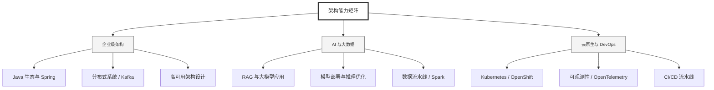

  <h1>你好，我是 Ellen Liu 👋</h1>
  

    <a href="README.md">English</a> | 
    <b>简体中文</b>
  

## 🧠 技术栈与核心能力

智能化企业系统建设路线图，涵盖全栈人工智能工程、云基础设施架构及模型部署等核心技术领域。

```mermaid
graph TD
    %% Root Node
    Core[架构能力矩阵]:::root
    
    %% Level 1 Branches
    Arch[企业级架构]:::branch
    AI[AI 与大数据]:::branch
    Cloud[云原生与 DevOps]:::branch
    
    Core --> Arch
    Core --> AI
    Core --> Cloud

    %% Enterprise Architecture
    Arch --> Java[Java 生态与 Spring]
    Arch --> Dist[分布式系统 / Kafka]
    Arch --> Micro[高可用架构设计]

    %% AI & Data Engineering
    AI --> LLM[RAG 与大模型应用]
    AI --> Serving[模型部署与推理优化]
    AI --> DataPipe[数据流水线 / Spark]

    %% Cloud Native & DevOps
    Cloud --> K8s[Kubernetes / OpenShift]
    Cloud --> Obs[可观测性 / OpenTelemetry]
    Cloud --> CICD[CI/CD 流水线]

    %% Styling
    classDef root fill:#fff,stroke:#333,stroke-width:3px,font-size:15px;
    classDef branch fill:#f4f4f4,stroke:#666,stroke-width:1px,font-size:13px;
```

## 🚀 Highlighted 工作

- **开源 AI 项目**: [基于 BERT 的声明检测模型](https://huggingface.co/XiaojingEllen/bert-finetuned-claim-detection) (Apache-2.0)
  - *已被哥伦比亚大学 (UBC) 研究项目引用。*
  - *手写 Transformer 核心代码，以验证理论与工程的一致性。*
- **金融基础设施**: 从 0 到 1 构建数字银行支付中间件及智能保险理赔系统。

## 📑 每日论文速递 (ArXiv)
<!-- DAILY_ARXIV_SUMMARY_START -->
**更新日期: 2026-08-26**

### 1. [SWE重构基准：编码智能体能否完成长周期、全仓库级技术栈迁移？](http://arxiv.org/abs/2608.23564v1)
- **摘要**: 现代软件系统在数十年的开发过程中积累了技术债务，这使得迁移成本高昂且主要依赖人工操作。随着编码智能体在修复错误方面日益强大，它们能否自主执行此类迁移？现有基准测试无法回答这一问题，因为它们仅评估行为正确性，而不评估迁移是否真正发生。这导致了一种简单的作弊手段：智能体复制原始实现以使测试通过。我们称之为“盲区”（Blindness）。为解决此问题，我们引入了SWE Refactor Bench，一个包含20个全仓库迁移任务的基准测试，覆盖4类技术债务。三阶段评估协议同时衡量迁移完整性和行为正确性。（1）迁移审计（Migration Audit）验证迁移是否确实发生。（2）行为测试（Behavioural Tests）使用固定测试套件衡量正确性。（3）智能体验证（Agentic Verification）利用6个独立编码智能体生成针对性测试，以发现隐藏的行为差异。在来自8个前沿模型和26种模型-努力配置的520次运行中，仅28次运行（5.4%）通过全部三个阶段，20个任务中有13个未获得任何可接受解决方案，最佳模型（claude-opus-5）得分为47.0/100。迁移完整性和行为正确性是两种不同的能力：少数运行通过跳过迁移来保持行为，在迁移审计阶段被阻止；大多数运行尝试迁移但破坏了行为，在行为测试阶段被阻止。智能体无法实现完美迁移：在通过迁移审计的340次运行中，58%达到了固定检查的99%，但仅26%达到了100%。智能体能力在不同迁移类别间存在差异：在构建工具链重写任务上得分31.4，但在语言重写任务上仅得分5.6。综合这些发现，SWE Refactor Bench定位为一个严格的测试平台，用于开发能够可靠执行全仓库迁移的编码智能体。

### 2. [Prime Agent：一种自我改进的RLM框架](http://arxiv.org/abs/2608.23552v1)
- **摘要**: 语言模型本质上是顺序处理器，但长期自主任务需要超越模型权重和活动上下文之外的外部信息与计算资源。Prime Agent 是一个开源框架，专为长期评估和编码代理工作流设计。其持久的 IPython REPL 遵循递归语言模型抽象，实现程序化上下文处理与测试时计算，而持续框架则跨轨迹保留历史记录、记忆、技能、提示和子代理规范。递归子代理通过直接的代理间通信进行协调，代理视图允许人类检查和管理由守护进程支持的会话。Prime Agent 标准化了执行、恢复、验证和资源核算，同时将策略构建留给模型本身。这种低摩擦、表达力强的接口防止了框架故障演变为模型故障，并将评估推向模型真实的最大底层能力。Prime Agent 将 ARC-AGI-3 RHAE Best@1 从 30% 提升至 95.5%，并在长上下文编码、GPU 内核生成、模拟器构建和自主 nanoGPT 速跑任务中，达到或超越原生及流行框架的性能。在 Factorio 实验中，我们发现细化机制支持持续技术进展，而专用子代理则实现并行化工作。代码可在 https://github.com/PrimeIntellect-ai/prime-agent 获取。

### 3. [通过安全方向惩罚缓解推理引发的对齐偏差](http://arxiv.org/abs/2608.23497v1)
- **摘要**: 推理引发的错位（Reasoning-Induced Misalignment, RIM）是指在仅包含无害内容的推理数据（如数学、代码及带思维链轨迹的问题求解）上进行微调，却可能诱发大语言模型（LLM）产生有害行为，这对LLM推理的安全性构成了严峻挑战。跨架构、跨规模及跨数据集的检验表明，RIM并非总是出现。以往研究将RIM归因于神经元层面的纠缠，但未识别出支撑这种纠缠的表示空间几何结构，也未提出训练阶段的修复方法。我们同时提供了这两方面：对RIM的表示空间分析，以及安全方向惩罚（Safety-Direction Penalty, SDP），后者在推理微调期间对沿学习到的安全方向的移动进行惩罚。该分析提取了激活空间中的两个方向，一个编码推理能力，另一个编码安全行为。这两个方向相互耦合：提升推理能力的微调会改变安全表示，且偏移更大的提示词显示出更严重的安全退化。CKA距离比率和探针定位了安全决策层，这些层中该偏移最为关键。这些发现指导了SDP的设计：耦合性促使对沿安全方向的位移进行惩罚，而层定位则设定了初始范围。当初始范围留下超出被惩罚层的补偿性偏移时，相同的诊断方法指导迭代扩展。在Qwen2.5-3B和7B模型上，SDP在保持基准推理性能的同时恢复了安全性。

<!-- DAILY_ARXIV_SUMMARY_END -->

## 🌐 保持联系

  
<i>期待与您探讨 AI 基础设施的未来！</i>

