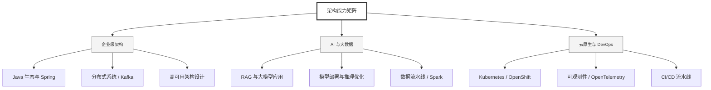

  <h1>你好，我是 Ellen Liu 👋</h1>
  

    <a href="README.md">English</a> | 
    <b>简体中文</b>
  

## 🧠 技术栈与核心能力

智能化企业系统建设路线图，涵盖全栈人工智能工程、云基础设施架构及模型部署等核心技术领域。

```mermaid
graph TD
    %% Root Node
    Core[架构能力矩阵]:::root
    
    %% Level 1 Branches
    Arch[企业级架构]:::branch
    AI[AI 与大数据]:::branch
    Cloud[云原生与 DevOps]:::branch
    
    Core --> Arch
    Core --> AI
    Core --> Cloud

    %% Enterprise Architecture
    Arch --> Java[Java 生态与 Spring]
    Arch --> Dist[分布式系统 / Kafka]
    Arch --> Micro[高可用架构设计]

    %% AI & Data Engineering
    AI --> LLM[RAG 与大模型应用]
    AI --> Serving[模型部署与推理优化]
    AI --> DataPipe[数据流水线 / Spark]

    %% Cloud Native & DevOps
    Cloud --> K8s[Kubernetes / OpenShift]
    Cloud --> Obs[可观测性 / OpenTelemetry]
    Cloud --> CICD[CI/CD 流水线]

    %% Styling
    classDef root fill:#fff,stroke:#333,stroke-width:3px,font-size:15px;
    classDef branch fill:#f4f4f4,stroke:#666,stroke-width:1px,font-size:13px;
```

## 🚀 Highlighted 工作

- **开源 AI 项目**: [基于 BERT 的声明检测模型](https://huggingface.co/XiaojingEllen/bert-finetuned-claim-detection) (Apache-2.0)
  - *已被哥伦比亚大学 (UBC) 研究项目引用。*
  - *手写 Transformer 核心代码，以验证理论与工程的一致性。*
- **金融基础设施**: 从 0 到 1 构建数字银行支付中间件及智能保险理赔系统。

## 📑 每日论文速递 (ArXiv)
<!-- DAILY_ARXIV_SUMMARY_START -->
**更新日期: 2026-08-25**

### 1. [步步为营：测量并引导大语言模型如何进行心理治疗](http://arxiv.org/abs/2608.21325v1)
- **摘要**: 用户越来越多地转向大型语言模型寻求情感支持，然而关于这些模型实际如何进行心理治疗互动，我们知之甚少。我们引入了一个包含十种治疗动作的本体论：这些是基于MULTI-60清单的紧凑、功能导向类别，通过五位持证心理学家的标注活动进行验证，并采用与专家一致性相匹配的基于评判者的方法进行扩展。将其应用于真实咨询记录和模型主导的会话中，我们比较了人类临床医生与一组前沿模型之间的动作分布。模型过度使用探究性提问，频率高达人类的三倍，忽视心理教育，并且强烈依赖上下文锚定：它们会延续人类临床医生发起的策略，但很少自行发起这些策略。将本体论作为一组工具暴露给模型，可将与人类动作分布的平均偏差减少约一半，并将与人类治疗师的回合级对齐度提高7至9个百分点，且无需任何微调。

### 2. [EnSI-RAG：面向长文档问答的实体结构索引检索增强生成](http://arxiv.org/abs/2608.21252v1)
- **摘要**: 针对长篇且相互关联的文档进行问答（QA）仍具挑战性，因为相关证据可能跨越多个实体及其关系。现有的检索增强生成（RAG）方法通常将文档索引为原始文本块，并通过嵌入相似性进行检索。当文本块边界将实体与支持证据分离，或问题需要跨语料库进行多跳推理时，其性能会下降。我们提出EnSI-RAG（实体结构索引检索增强生成），这是一个构建查询无关、以实体为中心的索引框架。每条记录（e, t, k, v）代表一个实体e、其类型t、语义类别k（属于{属性、关系、方面}）以及值v，同时保留与原始源文本段的链接。在查询时，这些记录作为检索句柄，由大语言模型（LLM）将检索到的文本段综合成最终答案。该设计将证据定位与答案生成分离，同时保留可追溯的源证据。在Loong和Oolong数据集上，EnSI-RAG的平均准确率达到78.24。相对于用作参考的已发布基线分数，这一结果高出6.62个百分点，表明其在这些场景下的有效性。代码可在https://github.com/RamonMeng/EnSI-RAG获取。

### 3. [从发明人风格披露到专利撰写的基准测试](http://arxiv.org/abs/2608.21249v1)
- **摘要**: 尽管近期的大语言模型（LLMs）在单项专利撰写任务上取得了令人鼓舞的成果，但它们从根本上未能解决现实世界专利撰写的核心挑战：即直接从早期发明材料中生成完整且法律上连贯的专利申请文件。以往的研究主要假设输入为后期阶段、高度结构化或已具备法律文本特征的材料。然而，实际的专利申请流程始于发明人撰写的非正式、去法律化的披露文件。为弥合这一差距，我们引入了Dis2Pat，一个反映现实专利申请流程的从披露到专利的数据集，要求直接从发明人风格、去法律化的披露文件中生成完整的专利申请文件。鉴于长篇幅、受法律约束的专利撰写本身固有的难度以及严格的隐私要求，我们进一步提出了一个名为Patent-MAF的强基线模型。它是一个用于本地部署的专利撰写的多智能体框架。基准测试结果显示，当前的大语言模型在专利撰写方面存在局限性，而Patent-MAF提供了一个强基线，持续优于所评估的开源模型，并与大型闭源模型保持竞争力。

<!-- DAILY_ARXIV_SUMMARY_END -->

## 🌐 保持联系

  
<i>期待与您探讨 AI 基础设施的未来！</i>

