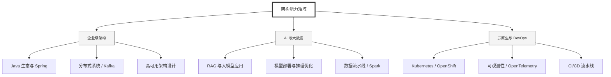

  <h1>你好，我是 Ellen Liu 👋</h1>
  

    <a href="README.md">English</a> | 
    <b>简体中文</b>
  

## 🧠 技术栈与核心能力

智能化企业系统建设路线图，涵盖全栈人工智能工程、云基础设施架构及模型部署等核心技术领域。

```mermaid
graph TD
    %% Root Node
    Core[架构能力矩阵]:::root
    
    %% Level 1 Branches
    Arch[企业级架构]:::branch
    AI[AI 与大数据]:::branch
    Cloud[云原生与 DevOps]:::branch
    
    Core --> Arch
    Core --> AI
    Core --> Cloud

    %% Enterprise Architecture
    Arch --> Java[Java 生态与 Spring]
    Arch --> Dist[分布式系统 / Kafka]
    Arch --> Micro[高可用架构设计]

    %% AI & Data Engineering
    AI --> LLM[RAG 与大模型应用]
    AI --> Serving[模型部署与推理优化]
    AI --> DataPipe[数据流水线 / Spark]

    %% Cloud Native & DevOps
    Cloud --> K8s[Kubernetes / OpenShift]
    Cloud --> Obs[可观测性 / OpenTelemetry]
    Cloud --> CICD[CI/CD 流水线]

    %% Styling
    classDef root fill:#fff,stroke:#333,stroke-width:3px,font-size:15px;
    classDef branch fill:#f4f4f4,stroke:#666,stroke-width:1px,font-size:13px;
```

## 🚀 Highlighted 工作

- **开源 AI 项目**: [基于 BERT 的声明检测模型](https://huggingface.co/XiaojingEllen/bert-finetuned-claim-detection) (Apache-2.0)
  - *已被哥伦比亚大学 (UBC) 研究项目引用。*
  - *手写 Transformer 核心代码，以验证理论与工程的一致性。*
- **金融基础设施**: 从 0 到 1 构建数字银行支付中间件及智能保险理赔系统。

## 📑 每日论文速递 (ArXiv)
<!-- DAILY_ARXIV_SUMMARY_START -->
**更新日期: 2026-09-16**

### 1. [ScienceBuddy：面向交互式科学智能体的递归中递归自我改进](http://arxiv.org/abs/2609.17523v1)
- **摘要**: 我们介绍并发布ScienceBuddy，一个交互式科学研究工作空间，将持续改进的科学智能体带入研究人员的日常工作流程。ScienceBuddy支持研究人员执行科学任务，同时将其请求、反馈和执行证据转化为用于持续学习的任务和评估标准。其核心是递归中的递归自我改进，这一范式将工具链演化与模型强化学习相结合：内层递归在模型固定的情况下改进工具链，而外层递归在改进后的工具链下训练模型。工具链演化塑造训练经验，模型学习为工具链适配创造新机会。我们展示了研究人员交互、工具链细化和模型学习的案例研究，基准案例涵盖四个科学任务家族。通过将ScienceBuddy作为研究产品发布，我们使这一范式可供科学界使用，并向发现智能迈出一步：科学AI通过与研究人员的持续协作而进步，并与其所支持的研究共同演化。网站：http://science-buddy.io

### 2. [大语言模型何时应当弃权？面向选择性风险控制的自我提问链方法](http://arxiv.org/abs/2609.17516v1)
- **摘要**: 大型语言模型在事实支撑薄弱时仍能生成流畅答案。本文提出自问链（Chain-of-Self-Questioning, CoSQ），一种仅依赖提示的框架，使答案承诺以对回答问题所需信息的显式评估为条件。我们在TruthfulQA多项选择验证集的817个条目上，使用十一个开放权重和托管模型系列，在十七种条件下评估了三种CoSQ变体。在最终平衡选项协议中，τ=0.90的Grounded-CoSQ将平均无条件错误承诺率从思维链提示下的13.1%降至8.9%，相对降低32.1%，同时将已作答准确率从86.9%提高到89.7%，并回答了87.6%的问题。这两项改进在全部十一个模型和每个评估阈值下均成立。Critical-CoSQ和Adaptive-CoSQ分别提供了覆盖率为88.6%和86.5%的邻近操作点，同时仍比基线更可靠。一项次要的自然问题短答案评估提供了收敛的开放形式证据。这些发现表明，当无支撑的承诺比转介或复核代价更高时，自我评估可以支持显式、可调的作答或弃答决策。

### 3. [在智能家居中，修剪会在什么情况下出现问题，以及何时出现？评估跨架构和任务复杂度的LLM退化](http://arxiv.org/abs/2609.17515v1)
- **摘要**: 剪枝可以降低大型语言模型（LLM）的部署成本，但其对基于上下文的工具调用的影响仍鲜有研究。我们系统性地研究了智能家居工具调用中由剪枝引起的性能退化，涵盖四种LLM，跨越稠密Transformer、稠密混合和专家混合（MoE）架构，并结合深度、宽度、混合和专家剪枝方法。在剪枝后监督微调（SFT）之后，我们评估了来自三个智能家居数据集的超过19,500个实例。除总体任务准确率外，我们还从两个维度刻画退化：动作组件（即操作、设备、参数和值）与任务复杂度。我们的结果表明，稠密模型的安全剪枝区间较窄，随后出现急剧退化，而MoE模型则能承受大幅得多的剪枝。剪枝会先损害基于上下文的特异性，再损害模式级意图，且激进的稠密剪枝可能引发系统性的过度拒绝。这些发现凸显了在选择用于可靠工具执行的剪枝LLM时，超越总体准确率来评估剪枝的重要性。

<!-- DAILY_ARXIV_SUMMARY_END -->

## 🌐 保持联系

  
<i>期待与您探讨 AI 基础设施的未来！</i>

