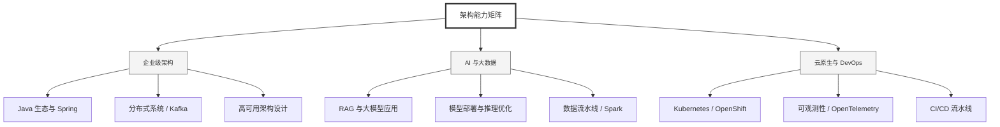

  <h1>你好，我是 Ellen Liu 👋</h1>
  

    <a href="README.md">English</a> | 
    <b>简体中文</b>
  

## 🧠 技术栈与核心能力

智能化企业系统建设路线图，涵盖全栈人工智能工程、云基础设施架构及模型部署等核心技术领域。

```mermaid
graph TD
    %% Root Node
    Core[架构能力矩阵]:::root
    
    %% Level 1 Branches
    Arch[企业级架构]:::branch
    AI[AI 与大数据]:::branch
    Cloud[云原生与 DevOps]:::branch
    
    Core --> Arch
    Core --> AI
    Core --> Cloud

    %% Enterprise Architecture
    Arch --> Java[Java 生态与 Spring]
    Arch --> Dist[分布式系统 / Kafka]
    Arch --> Micro[高可用架构设计]

    %% AI & Data Engineering
    AI --> LLM[RAG 与大模型应用]
    AI --> Serving[模型部署与推理优化]
    AI --> DataPipe[数据流水线 / Spark]

    %% Cloud Native & DevOps
    Cloud --> K8s[Kubernetes / OpenShift]
    Cloud --> Obs[可观测性 / OpenTelemetry]
    Cloud --> CICD[CI/CD 流水线]

    %% Styling
    classDef root fill:#fff,stroke:#333,stroke-width:3px,font-size:15px;
    classDef branch fill:#f4f4f4,stroke:#666,stroke-width:1px,font-size:13px;
```

## 🚀 Highlighted 工作

- **开源 AI 项目**: [基于 BERT 的声明检测模型](https://huggingface.co/XiaojingEllen/bert-finetuned-claim-detection) (Apache-2.0)
  - *已被哥伦比亚大学 (UBC) 研究项目引用。*
  - *手写 Transformer 核心代码，以验证理论与工程的一致性。*
- **金融基础设施**: 从 0 到 1 构建数字银行支付中间件及智能保险理赔系统。

## 📑 每日论文速递 (ArXiv)
<!-- DAILY_ARXIV_SUMMARY_START -->
**更新日期: 2026-09-23**

### 1. [Flash-dLLM：面向快速、内存高效扩散LLM的IO感知KV缓存与并行解码](http://arxiv.org/abs/2609.26796v1)
- **摘要**: 扩散大语言模型（dLLMs）近期作为一种有前景的自回归大语言模型替代方案出现，其能够实现非自回归文本生成。然而，其实际部署仍受限于低效的推理，这在很大程度上是由于缺乏有效的键值（KV）缓存和可扩展的并行解码机制。现有的加速方法通常孤立地研究KV缓存和并行解码，忽视了当缓存复用与并行令牌验证联合应用时出现的I/O瓶颈。在这项工作中，我们介绍了$\textbf{Flash-dLLM}$，一个用于快速且内存高效dLLMs的免训练推理加速框架。Flash-dLLM首先将GPU内存I/O识别为启用KV缓存的dLLM推理中的主要瓶颈，并通过一种I/O感知的融合KV缓存内核来解决它，该内核减少了冗余的内存移动。基于这一优化的缓存机制，Flash-dLLM进一步提出了一种高效的KV缓存驱动的草拟与验证解码策略，其中dLLM本身同时充当草拟器和验证器，无需辅助模型。这种统一设计实现了更快的解码，同时保持生成质量并提高对更长序列和更大批大小的可扩展性。在数学推理和代码生成基准上的大量实验表明，Flash-dLLM在推理速度和内存效率方面始终优于现有的最先进dLLM加速方法。特别是，它在GSM8K和HumanEval上分别比先前最强基线Elastic-Cache实现了$5.1\times$和$11.0\times$的加速。

### 2. [Agensh：将组织智能扩展至1，024个代理](http://arxiv.org/abs/2609.26781v1)
- **摘要**: 多智能体系统可以通过并发执行任务来降低复杂任务的延迟。已有若干开创性的编排框架支持多智能体系统。然而，当前多智能体编排框架的可扩展性往往受限于中心编排器分配任务和协调工作者的能力。为解决这一局限，我们提出Agensh，一种可扩展的自组织多智能体编排框架，无需中心编排器：并发工作者执行多智能体协作循环，持续收集上下文、认领并自行分配子任务、采取行动并共享发现、验证结果，并以异步方式合并进展。该循环由智能体组织基础设施支撑，包含三个组件：共享工作区保存已提出、进行中和已完成的工作；消息接口让工作者进行通信；共享上下文保留可复用的发现和工作意图。为测试Agensh的可扩展性，我们在五个最难的ProgramBench任务上使用GPT-5.6-sol（high）对其进行评估。从1个智能体扩展到128个智能体，平均最终测试通过率从19.31%提升至28.78%，相对提升约49%。更大的组织更早达到相当的测试通过率。在pandoc上，从1个智能体扩展到1,024个智能体，最终测试通过率从33.89%提升至55.06%。工作者轨迹进一步表明，不同形式的自组织协作随着组织规模增长而逐渐涌现并标准化。这些结果揭示了智能体数量作为多智能体组织的新扩展维度，可拓展通用智能的前沿，为硬延迟约束或时间预算下的复杂任务提供了实用解决方案。

### 3. [SpeakerMem-R1：面向多方对话的以说话人为中心的双轨记忆](http://arxiv.org/abs/2609.26780v1)
- **摘要**: 多方场景下的长期对话记忆不仅需要从长期对话中检索相关内容，还必须区分谁说了什么、每句话涉及谁、个体如何彼此认知、群体共享哪些信息，以及状态如何随时间变化。近期关于多方对话基准的研究表明，现有通用大语言模型记忆系统往往会丢失人物与群体关系，或难以整合分散在成员、群体和时间中的线索。这些问题共同揭示了两个核心瓶颈：多方对话中的消息归属与关系理解，以及从交错历史中进行状态重建。为解决这两个问题，我们提出$\textbf{SpeakerMem-R1}$：其双轨记忆存储带说话人标注的逐字消息，以及组织为个人级和群体级视图的派生状态，并在查询时按实体、事件和时间融合两条轨道的证据。为减少结构化记忆构建过程中的归属与更新错误，同时支持本地部署，我们使用SpeakerLevenshtein和以说话人为条件的GRPO训练Writer-R1。在GroupMemBench、SocialMemBench和EverMemBench上，SpeakerMem-R1分别达到47.9%、69.2%和61.9%的二分类准确率。在EverMind-AI公开报告的EverMemBench排行榜上，我们达到62.33%，为最新最先进框架中报告的最佳结果。在全部1,986个LoCoMo问题上，我们也达到70.85%，并将其用作双人长期对话的边界测试。在一项包含305个问题的受控评估中，强化学习将SFT Writer的平均准确率从57.38%提升至68.20%。我们同时报告二分类准确率和token-F1，消融实验表明，在标准化评估接口下，逐字轨道与结构化轨道，以及个人级与群体级视图，具有互补性。

<!-- DAILY_ARXIV_SUMMARY_END -->

## 🌐 保持联系

  
<i>期待与您探讨 AI 基础设施的未来！</i>

