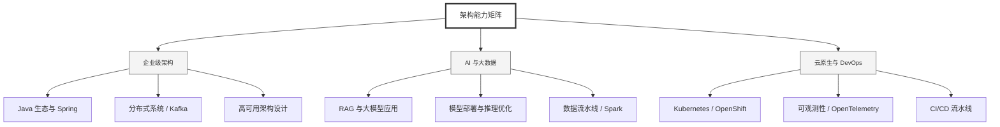

  <h1>你好，我是 Ellen Liu 👋</h1>
  

    <a href="README.md">English</a> | 
    <b>简体中文</b>
  

## 🧠 技术栈与核心能力

智能化企业系统建设路线图，涵盖全栈人工智能工程、云基础设施架构及模型部署等核心技术领域。

```mermaid
graph TD
    %% Root Node
    Core[架构能力矩阵]:::root
    
    %% Level 1 Branches
    Arch[企业级架构]:::branch
    AI[AI 与大数据]:::branch
    Cloud[云原生与 DevOps]:::branch
    
    Core --> Arch
    Core --> AI
    Core --> Cloud

    %% Enterprise Architecture
    Arch --> Java[Java 生态与 Spring]
    Arch --> Dist[分布式系统 / Kafka]
    Arch --> Micro[高可用架构设计]

    %% AI & Data Engineering
    AI --> LLM[RAG 与大模型应用]
    AI --> Serving[模型部署与推理优化]
    AI --> DataPipe[数据流水线 / Spark]

    %% Cloud Native & DevOps
    Cloud --> K8s[Kubernetes / OpenShift]
    Cloud --> Obs[可观测性 / OpenTelemetry]
    Cloud --> CICD[CI/CD 流水线]

    %% Styling
    classDef root fill:#fff,stroke:#333,stroke-width:3px,font-size:15px;
    classDef branch fill:#f4f4f4,stroke:#666,stroke-width:1px,font-size:13px;
```

## 🚀 Highlighted 工作

- **开源 AI 项目**: [基于 BERT 的声明检测模型](https://huggingface.co/XiaojingEllen/bert-finetuned-claim-detection) (Apache-2.0)
  - *已被哥伦比亚大学 (UBC) 研究项目引用。*
  - *手写 Transformer 核心代码，以验证理论与工程的一致性。*
- **金融基础设施**: 从 0 到 1 构建数字银行支付中间件及智能保险理赔系统。

## 📑 每日论文速递 (ArXiv)
<!-- DAILY_ARXIV_SUMMARY_START -->
**更新日期: 2026-08-01**

### 1. [AskChem：面向化学文献综合的以主张为中心的基础设施](http://arxiv.org/abs/2607.28618v1)
- **摘要**: 化学文献综述通常需要整合分散在众多出版物中的具体研究发现，然而现有的文献检索系统主要返回排序后的文档列表。因此，科学家和AI代理需要自行定位相关信息、验证其来源，并手动整合跨论文的答案。我们提出AskChem，一种以声明为中心的基础设施，用于跨论文化学检索。AskChem将检索单元从论文转变为携带来源的声明：每篇论文被转化为原子化、带类型的声明，每条声明均以源DOI和逐字引用或明确的证据定位符为依据。在此共享声明存储之上，AskChem提供了互补的检索与综合结构：用于分层检索和浏览的稳定分面分类法、通过关系连接声明的证据图，以及将索引论文置于科学原理之下的探索性动态分类法。AskChem目前索引了来自147K篇论文的240万条声明，并提供网页界面，以及面向AI代理的REST、SDK和MCP访问方式。在AskChem-Bench上，将GPT-5.5阅读器基于AskChem进行接地，可实现100%可解析的DOI，而未经检索时为88.3%，并且在五个测试系统中获得了最高的引用密度。AskChem已上线，访问地址为https://askchem.org。

### 2. [OSReward：为跨平台计算机使用奖励模型建立标准化评估体系](http://arxiv.org/abs/2607.28609v1)
- **摘要**: 计算机使用智能体（CUA）正在数字世界中快速发展。CUA轨迹记录了智能体的动作、状态和推理过程。验证其是否完成了任务指令，是CUA评估、数据整理和强化学习的核心环节。人工编写的验证器或人工标注者都无法大规模提供此类验证，因此该领域日益转向使用视觉语言模型（VLM）作为CUA轨迹的评判者。但一个根本性问题长期未被审视：这些VLM评判者是否足够可靠？为系统研究这一问题，我们引入了OSReward，一个真实、高质量的基准，用于评估VLM评判者在CUA轨迹上的表现。这些轨迹来自多种智能体主干，执行经过人工验证的指令，跨平台运行，随后通过多阶段人工标注严格标记出真实结论。在此基础上，我们衍生出OSReward-Hard，一个聚焦于真正困难案例的挑战集，以及OSReward-Multi，用于细粒度的效率和一致性评分。迄今为止最全面的VLM评判者评估发现，即使是最先进的模型也未能达到理想评判者的标准，它们普遍存在系统性宽松偏差，将失败运行误标为成功。少数足够可靠的模型因成本过高而无法大规模运行，而价格适中的开源模型则远远落后。为弥合这一差距，我们构建并发布了OS-Shepherd-100K，一个面向CUA社区、带有推理标注的轨迹判断开放语料库。在此基础上，我们训练了OS-Shepherd（9B和35B），这些开源奖励模型提供低成本、稳定且可靠的奖励信号，在匹配商业评判者性能的同时，成本比前沿模型低30-60%。广泛的分析进一步为大规模可靠CUA奖励的设计提供了参考。我们的代码、基准、数据集和模型检查点可在 https://os-copilot.github.io/OSReward-Home/ 获取。

### 3. [Change2Task：从仓库变更到可执行的编码代理任务与环境](http://arxiv.org/abs/2607.28591v1)
- **摘要**: 扩展编码智能体（coding agents）的规模，需要持续供应可执行数据，用于训练、基准测试和持续评估。每项任务必须将真实的软件状态与规格说明、开发工具和可靠的验证机制相结合。为扩大这一供应，我们提出了Change2Task系统，该系统基于仓库历史，将已合并的拉取请求（pull requests）转换为同一仓库健康现代版本上的已验证任务。它使历史证据与演化后的代码对齐，通过补丁反转（Patch Reversal）、代码映射（Code Mapping）或智能体重建（Agent Reconstruction）重构任务状态，并验证从健康基线到任务状态及恢复状态的完整生命周期。通过从维护良好的环境中派生多个基于开发者证据的任务，Change2Task为编码智能体的训练和评估提供了可执行数据，同时减少了重复的环境设置、存储和任务构建工作。我们通过五种常见且广泛采用的编码智能体任务族评估该系统：缺陷修复（Bug Fix）、功能添加（Feature Addition）、测试生成（Test Generation）、应用程序编程接口迁移（API Migration）和安全修复（Security Repair）。从1,130个符合构建条件的源代码变更出发，Change2Task在这些任务族中实现了79.6%的已验证任务构建成功率。在匹配的候选集上，它比基于拉取请求的构建基线多恢复了29.2%的已验证任务。历史和重建案例在智能体评估下实现了高达98.0%的匹配结果一致性，而现代基线的重用使整个流程的测量支出减少了10.8%。

<!-- DAILY_ARXIV_SUMMARY_END -->

## 🌐 保持联系

  
<i>期待与您探讨 AI 基础设施的未来！</i>

