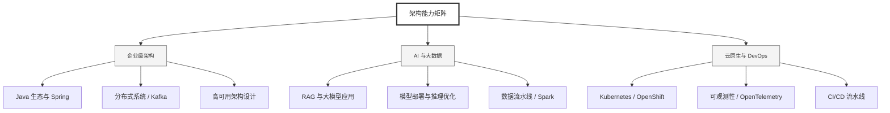

  <h1>你好，我是 Ellen Liu 👋</h1>
  

    <a href="README.md">English</a> | 
    <b>简体中文</b>
  

## 🧠 技术栈与核心能力

智能化企业系统建设路线图，涵盖全栈人工智能工程、云基础设施架构及模型部署等核心技术领域。

```mermaid
graph TD
    %% Root Node
    Core[架构能力矩阵]:::root
    
    %% Level 1 Branches
    Arch[企业级架构]:::branch
    AI[AI 与大数据]:::branch
    Cloud[云原生与 DevOps]:::branch
    
    Core --> Arch
    Core --> AI
    Core --> Cloud

    %% Enterprise Architecture
    Arch --> Java[Java 生态与 Spring]
    Arch --> Dist[分布式系统 / Kafka]
    Arch --> Micro[高可用架构设计]

    %% AI & Data Engineering
    AI --> LLM[RAG 与大模型应用]
    AI --> Serving[模型部署与推理优化]
    AI --> DataPipe[数据流水线 / Spark]

    %% Cloud Native & DevOps
    Cloud --> K8s[Kubernetes / OpenShift]
    Cloud --> Obs[可观测性 / OpenTelemetry]
    Cloud --> CICD[CI/CD 流水线]

    %% Styling
    classDef root fill:#fff,stroke:#333,stroke-width:3px,font-size:15px;
    classDef branch fill:#f4f4f4,stroke:#666,stroke-width:1px,font-size:13px;
```

## 🚀 Highlighted 工作

- **开源 AI 项目**: [基于 BERT 的声明检测模型](https://huggingface.co/XiaojingEllen/bert-finetuned-claim-detection) (Apache-2.0)
  - *已被哥伦比亚大学 (UBC) 研究项目引用。*
  - *手写 Transformer 核心代码，以验证理论与工程的一致性。*
- **金融基础设施**: 从 0 到 1 构建数字银行支付中间件及智能保险理赔系统。

## 📑 每日论文速递 (ArXiv)
<!-- DAILY_ARXIV_SUMMARY_START -->
**更新日期: 2026-08-20**

### 1. [用于放射学报告结构化与质量保证的多智能体AI系统，并附带独立放射科医生评估](http://arxiv.org/abs/2608.18072v1)
- **摘要**: 目的：开发并评估一种本地部署的多智能体AI系统，用于放射学报告结构化和质量保证。材料与方法：本回顾性研究纳入了2023年和2024年由15名经委员会认证的放射科医生口述的638份胸部、腹部和盆腔CT检查放射学报告。开发了一种多智能体AI流水线，用于执行报告结构化和质量保证（QA）。该系统使用正则表达式规则和本地大型语言模型，在句子级别将报告结构化为标准解剖部分。它还检测了“发现”与“印象”部分之间或部分内部的不匹配、性别与解剖结构冲突，以及关键发现未记录沟通的情况。两名经委员会认证的放射科医生独立评估了一个包含45份报告的子集。结果：多智能体系统将所有报告（22，270个句子）的“发现”部分结构化为预定义的解剖格式，同时保留原始报告内容。系统标记了90份（14.1%）报告，最常见的原因是部分不匹配（80份报告，12.5%）。在放射科医生评估中，两位评审者一致认为31份（69%）报告被正确重构，2份（4%）报告被错误重构，并对其余12份（27%）报告存在分歧。两位评审者一致认为没有遗漏临床重要信息，也没有引入捏造内容。总体QA性能在84%的评估报告中被评为“优秀”或“良好”，其余报告被评为“一般”。结论：一种本地部署的多智能体AI系统将放射学报告结构化和质量保证整合到单一工作流程中。该系统在放射科医生评估中表现出良好的性能。此类系统可能支持放射学实践中的报告标准化和质量保证。

### 2. [论自我改进智能体的脆弱性：方差、任务顺序与欠规格化](http://arxiv.org/abs/2608.18066v1)
- **摘要**: 基于记忆的自我改进智能体——即通过在线任务流学习，并借助维护文本记忆库随时间提升性能的智能体——在近期文献中展现出巨大潜力。然而，这些方法的可靠性方面却被严重忽视。在本研究中，我们对两种基于记忆的方法进行了全面重新评估，沿两个维度拓宽了评估范围：（1）包含多次运行以量化方差，（2）随机打乱任务顺序以探究任务顺序的影响。通过这些实验，我们得出两个观察结果，揭示了当前方法的脆弱性：首先，在复杂环境和多步骤任务中，智能体评估本质上存在噪声，而叠加自我改进循环可能进一步放大这种噪声。其次，智能体的改进高度依赖于任务顺序。先前工作常采用默认顺序，这隐含了一种课程式安排，成为成功的隐性前提。

为更深入理解这种脆弱性，我们手动检查了智能体的记忆，并假设任务与环境的不充分规格化是导致此脆弱性的因素之一。我们通过将能提供更好规格化的信息（如详细评分标准和环境反馈）纳入记忆构建过程来验证这一假设。虽然这些附加信息部分弥补了先前实验中的性能下降，但显著差距仍然存在，表明其他未表征因素也对此脆弱性有所贡献。展望未来，我们的工作倡导对自我改进智能体采用更严格的评估协议，即跨多次运行报告结果，并在挑战性条件下进行压力测试。此外，我们关于不充分规格化的发现呼吁构建支持有效人类监督的系统与界面，以防止智能体以不可预见的方式失败。

### 3. [语言具有两个参数：叙事引发的语义可塑性与相位敏感解读](http://arxiv.org/abs/2608.18041v1)
- **摘要**: 语言有两个参数。统计词语共现的频率，可以估算出振幅，即关联的强度。词嵌入和注意力权重优化了这一计数过程，该过程将语料库中的所有作者汇总在一起。本文提出存在第二个参数——相位，而语料库中学习到的带符号权重并不提供这一参数。相位仅存在于意义之间：它决定共激活的意义如何组合，并且能在某个意义完全呈现的同时逆转该意义所贡献的内容。说话者可以通过语言形式在信号中设置相位；遭遇会建立相位关系，而历史则分布这些关系。群体平均会抹除历史索引的相位：去除主体索引的语料库只能识别群体的边际状态，无法确定任何个体或二元状态，无论尺度如何。标准Transformer在冻结推理中没有显式表示相位，而以单义性衡量进展的可解释性项目正在与之背道而驰：它视为缺陷的共存状态，恰恰是暗指、反讽和引用的条件。六项预测检验了被抑制的意义是否保持活跃、遭遇顺序是否改变短语的功能、标记信号是否改变共享短语的理解方式，以及模型在获得历史后是被其改变还是仅被告知相关信息。本文捍卫的是弱版本论点：解释需要第二个关系参数，该参数带符号、持久，并索引至个体和二元组。量子概率是该参数的一种表示法；形式体系中并无任何内容声称大脑中存在量子过程。强版本论点，即量子演算以带符号经典模型无法做到的方式约束这些现象，依赖于尚未推导出的遭遇顺序约束。该理论所要求的架构是一种具有主体索引、携带相位的语义状态的语言模型。

<!-- DAILY_ARXIV_SUMMARY_END -->

## 🌐 保持联系

  
<i>期待与您探讨 AI 基础设施的未来！</i>

