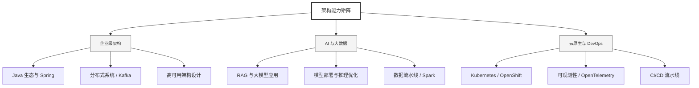

  <h1>你好，我是 Ellen Liu 👋</h1>
  

    <a href="README.md">English</a> | 
    <b>简体中文</b>
  

## 🧠 技术栈与核心能力

智能化企业系统建设路线图，涵盖全栈人工智能工程、云基础设施架构及模型部署等核心技术领域。

```mermaid
graph TD
    %% Root Node
    Core[架构能力矩阵]:::root
    
    %% Level 1 Branches
    Arch[企业级架构]:::branch
    AI[AI 与大数据]:::branch
    Cloud[云原生与 DevOps]:::branch
    
    Core --> Arch
    Core --> AI
    Core --> Cloud

    %% Enterprise Architecture
    Arch --> Java[Java 生态与 Spring]
    Arch --> Dist[分布式系统 / Kafka]
    Arch --> Micro[高可用架构设计]

    %% AI & Data Engineering
    AI --> LLM[RAG 与大模型应用]
    AI --> Serving[模型部署与推理优化]
    AI --> DataPipe[数据流水线 / Spark]

    %% Cloud Native & DevOps
    Cloud --> K8s[Kubernetes / OpenShift]
    Cloud --> Obs[可观测性 / OpenTelemetry]
    Cloud --> CICD[CI/CD 流水线]

    %% Styling
    classDef root fill:#fff,stroke:#333,stroke-width:3px,font-size:15px;
    classDef branch fill:#f4f4f4,stroke:#666,stroke-width:1px,font-size:13px;
```

## 🚀 Highlighted 工作

- **开源 AI 项目**: [基于 BERT 的声明检测模型](https://huggingface.co/XiaojingEllen/bert-finetuned-claim-detection) (Apache-2.0)
  - *已被哥伦比亚大学 (UBC) 研究项目引用。*
  - *手写 Transformer 核心代码，以验证理论与工程的一致性。*
- **金融基础设施**: 从 0 到 1 构建数字银行支付中间件及智能保险理赔系统。

## 📑 每日论文速递 (ArXiv)
<!-- DAILY_ARXIV_SUMMARY_START -->
**更新日期: 2026-08-30**

### 1. [CritICL：从小型语言模型失败模式中实现推理时的弱到强泛化](http://arxiv.org/abs/2608.27455v1)
- **摘要**: 推理时扩展（inference-time scaling）的最新进展显著提升了大语言模型（LLMs）的推理性能。然而，这些方法通常依赖于重复生成或外部验证。为解决这一局限，我们引入了CritICL，一种新颖的推理时框架，它在保持高效率的同时提升了推理能力。我们的关键洞察在于，同一模型家族内，LLM的失败模式在不同规模间表现出结构化规律。我们并未将失败视为不理想的输出，而是将其作为指导来源加以利用。具体而言，我们利用从较弱模型中得出的失败模式，并通过基于批评的上下文示例将其融入推理过程。我们提出了两种变体：CritICL-dynamic，它能自适应地预测输入特定的失败模式并检索批评；以及CritICL-static，它利用全局失败模式概况提供稳定指导。实验结果表明，CritICL在标准上下文学习上持续取得更优表现，并在性能上与测试时扩展方法相当或更胜一筹，同时所需生成次数和令牌成本显著降低。代码可在 https://github.com/umwyf/CRITICL 获取。

### 2. [WikiSkill：将智能体经验编译为持久知识以促进技能进化](http://arxiv.org/abs/2608.27454v1)
- **摘要**: Agent技能包将专业知识和操作流程封装为可复用资源，从而扩展AI代理的能力。近期研究从代理经验中自动发现此类技能，使代理能够通过交互逐步适应。然而，指导技能发展的洞见通常分散在优化历史中，限制了其在迭代中的系统性复用。我们提出WikiSkill框架，该框架将代理技能与持久化知识库（wiki）协同演化。在高层次上，WikiSkill分离了原始执行经验、积累的知识和可执行技能，同时持续将经验整合进wiki，后续技能更新可在此基础上构建。在多种基准测试和模型中，WikiSkill始终优于最先进的技能演化方法，并在大多数模型-基准组合中超越无技能基线。我们发现技能演化与模型扩展相辅相成：较大的模型通常从演化技能中获益更多，而带技能的较小模型可超越不带技能的显著更大模型。我们还发现，演化技能在模型间及模型家族间有效迁移，且由其他模型演化的技能可优于自演化技能。最后，我们的消融研究证实，wiki中持久知识积累对有效技能演化至关重要。这些结果展示了系统化积累和精炼代理经验对于开发可复用、可迁移技能的优势。

### 3. [SWE-Prime：更少的轨迹，更优的性能](http://arxiv.org/abs/2608.27449v1)
- **摘要**: 为了提升大型语言模型解决现实世界软件问题的能力，先前的工作侧重于构建大规模智能体轨迹数据集，并对成功轨迹进行监督微调（SFT）。然而，任务成功并不保证监督质量的高标准：成功轨迹可能仍包含无效、冗余或风险步骤。直接使用此类轨迹进行SFT会引入噪声监督，并促使模型模仿不良的问题解决行为。因此，我们提出SWE-Prime，一种多粒度、两阶段的SFT数据选择方法，逐步在轨迹和片段层面过滤训练数据。具体而言，第一阶段基于过程质量、结果质量和数据代表性进行轨迹级筛选，选择高质量且具代表性的成功轨迹子集。第二阶段通过将连续步骤分组为语义片段，并根据每个片段对最终解决方案的贡献、可学习性和潜在风险进行评估，进行片段级选择。在SFT过程中，所有片段保留在序列中以维持上下文，而仅选中的片段参与损失计算。在SWE-Bench Pro和SWE-Bench Verified上的实验表明，使用SWE-Prime选出的10%轨迹子集进行训练，优于在完整已解决数据集上的训练，相对性能提升分别高达12.2%和24.2%。

<!-- DAILY_ARXIV_SUMMARY_END -->

## 🌐 保持联系

  
<i>期待与您探讨 AI 基础设施的未来！</i>

