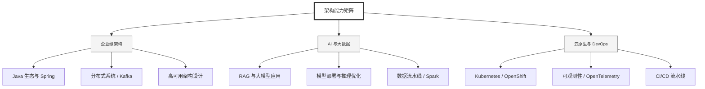

  <h1>你好，我是 Ellen Liu 👋</h1>
  

    <a href="README.md">English</a> | 
    <b>简体中文</b>
  

## 🧠 技术栈与核心能力

智能化企业系统建设路线图，涵盖全栈人工智能工程、云基础设施架构及模型部署等核心技术领域。

```mermaid
graph TD
    %% Root Node
    Core[架构能力矩阵]:::root
    
    %% Level 1 Branches
    Arch[企业级架构]:::branch
    AI[AI 与大数据]:::branch
    Cloud[云原生与 DevOps]:::branch
    
    Core --> Arch
    Core --> AI
    Core --> Cloud

    %% Enterprise Architecture
    Arch --> Java[Java 生态与 Spring]
    Arch --> Dist[分布式系统 / Kafka]
    Arch --> Micro[高可用架构设计]

    %% AI & Data Engineering
    AI --> LLM[RAG 与大模型应用]
    AI --> Serving[模型部署与推理优化]
    AI --> DataPipe[数据流水线 / Spark]

    %% Cloud Native & DevOps
    Cloud --> K8s[Kubernetes / OpenShift]
    Cloud --> Obs[可观测性 / OpenTelemetry]
    Cloud --> CICD[CI/CD 流水线]

    %% Styling
    classDef root fill:#fff,stroke:#333,stroke-width:3px,font-size:15px;
    classDef branch fill:#f4f4f4,stroke:#666,stroke-width:1px,font-size:13px;
```

## 🚀 Highlighted 工作

- **开源 AI 项目**: [基于 BERT 的声明检测模型](https://huggingface.co/XiaojingEllen/bert-finetuned-claim-detection) (Apache-2.0)
  - *已被哥伦比亚大学 (UBC) 研究项目引用。*
  - *手写 Transformer 核心代码，以验证理论与工程的一致性。*
- **金融基础设施**: 从 0 到 1 构建数字银行支付中间件及智能保险理赔系统。

## 📑 每日论文速递 (ArXiv)
<!-- DAILY_ARXIV_SUMMARY_START -->
**更新日期: 2026-08-18**

### 1. [信息满意度：以读者为中心的摘要评估轴心](http://arxiv.org/abs/2608.14457v1)
- **摘要**: 大多数关于摘要评估的研究主要聚焦于摘要的总体质量（如ROUGE、BERTScore）或特定期望属性（如可读性、事实性）。然而，这些指标未能衡量摘要对个体用户的实用性。例如，一位正在学习最新疫苗研究的生物医学研究者与一位家庭医生的信息需求截然不同。查询聚焦摘要虽能部分捕捉这一需求，但在实际应用中，用户很少在查询中完整陈述所有相关信息：一个简短的查询很可能不足以区分研究者与医生的需求差异。相比之下，读者的背景或身份特征（其角色与专业水平）在不同查询间相对稳定，并能恢复大量缺失的上下文信息，这使得它成为评估摘要是否满足读者需求的一个实用信号。在本研究中，我们评估了流行摘要指标对信息差异和身份差异的敏感度，发现许多常用指标，包括强大的基于大语言模型的评判指标，在信息内容的基本扰动测试中表现不佳。此外，我们进行了专家人工评估，基于特定个人背景和使用场景下的信息满意度来衡量摘要偏好。我们发现，传统指标和基于大语言模型的指标均不足以衡量信息满意度，且与人类判断的一致性较差。

### 2. [AI推荐哪位医生？大型语言模型辅助选择医生中的声誉与人口统计信号算法审计](http://arxiv.org/abs/2608.14399v1)
- **摘要**: 患者越来越多地向大语言模型（LLM）助手咨询该看哪位医生，这使得这些系统成为AI信息中介：即通过算法在人与人之间介入选择，从而悄无声息地、大规模地决定哪些医生会进入公众视野。我们报告了一项预先设定的随机算法审计，旨在探究究竟是什么因果性地推动了这些推荐。七个模型（六个开放权重模型；gpt-4o-mini）各自在五个合成的家庭医学医生卡片中进行选择，这些卡片的属性在3024个选择集、三个患者角色、九个提示改写版本和九个实验组中独立随机化，共产生40068个评分响应；性别和族裔通过姓名信号传递，遵循通信审计方法。声誉信号占据主导地位：将评分从3.9提高到4.7会使选择概率增加31.4个百分点（pp），而将费用从90美元提高到190美元则会使选择概率降低20.0个百分点。人口统计均等性被拒绝，但方向与人类审计研究的预测相反：女性信号姓名获得2.5个百分点的优势，西班牙裔、南亚裔和黑人信号姓名相比白人信号姓名获得1.3至2.9个百分点的优势，这些倾斜在费用等效上相当于每次就诊价值7至14美元，而无实质内容的首位位置价值11美元。然而，模型在最多0.03%的陈述理由中提及性别或族裔，并在0.39%的试验中选择弃权，因此这些效应在模型自身的解释中不可见，依赖模型自我报告的透明度义务将无法检测到它们。一个推理模型完全未能通过预设的可审计性门槛。冻结的设计使审计具有可重复性：任何新模型都可以针对相同的刺激进行评估，从而使定期行为审计（而非自我报告的解释）成为适合目的的监测技术。

### 3. [大语言模型不为跳跃买单](http://arxiv.org/abs/2608.14397v1)
- **摘要**: Zahavy [2026] 认为，大型语言模型尽管具备归纳与演绎能力，却无法执行产生爱因斯坦等效原理的溯因性“跳跃”，并将此局限归因于缺乏具身模拟。Zheng-Xin [2026] 和 Farmer [2026] 则质疑具身性是否为溯因推理所必需，指出通往广义相对论的其他路径以及无需感觉运动奠基的溯因形式。马克斯·普朗克于1900年解决了黑体辐射问题。普朗克转向 E = hν 的举措并不需要具身模拟。其动机源于经典理论的一个数学推论——对有限测量量预测出无限能量——这在物理上无法接受。我们表明，归纳与演绎均无法产生这一假设，并论证其采纳需要认识论错误与物理代价之间的耦合。我们通过热力学耦合形式化这一区分，并证明固定权重的Transformer推理缺乏此类耦合，无论模型规模如何。这与实证结果一致：随着因果难度急剧增加，输出熵几乎保持不变，即便准确率从100%降至17%。因此，我们认为机器溯因推理中缺失的要素可能比具身性更为深层：系统必须具有某种物理机制，使认识论错误变得代价高昂，从而迫使修正发生。

<!-- DAILY_ARXIV_SUMMARY_END -->

## 🌐 保持联系

  
<i>期待与您探讨 AI 基础设施的未来！</i>

