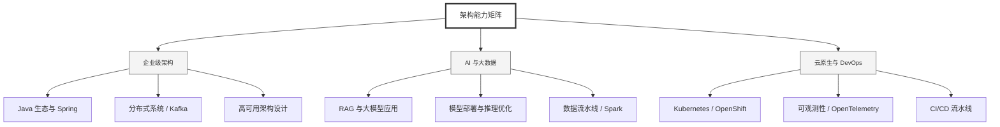

  <h1>你好，我是 Ellen Liu 👋</h1>
  

    <a href="README.md">English</a> | 
    <b>简体中文</b>
  

## 🧠 技术栈与核心能力

智能化企业系统建设路线图，涵盖全栈人工智能工程、云基础设施架构及模型部署等核心技术领域。

```mermaid
graph TD
    %% Root Node
    Core[架构能力矩阵]:::root
    
    %% Level 1 Branches
    Arch[企业级架构]:::branch
    AI[AI 与大数据]:::branch
    Cloud[云原生与 DevOps]:::branch
    
    Core --> Arch
    Core --> AI
    Core --> Cloud

    %% Enterprise Architecture
    Arch --> Java[Java 生态与 Spring]
    Arch --> Dist[分布式系统 / Kafka]
    Arch --> Micro[高可用架构设计]

    %% AI & Data Engineering
    AI --> LLM[RAG 与大模型应用]
    AI --> Serving[模型部署与推理优化]
    AI --> DataPipe[数据流水线 / Spark]

    %% Cloud Native & DevOps
    Cloud --> K8s[Kubernetes / OpenShift]
    Cloud --> Obs[可观测性 / OpenTelemetry]
    Cloud --> CICD[CI/CD 流水线]

    %% Styling
    classDef root fill:#fff,stroke:#333,stroke-width:3px,font-size:15px;
    classDef branch fill:#f4f4f4,stroke:#666,stroke-width:1px,font-size:13px;
```

## 🚀 Highlighted 工作

- **开源 AI 项目**: [基于 BERT 的声明检测模型](https://huggingface.co/XiaojingEllen/bert-finetuned-claim-detection) (Apache-2.0)
  - *已被哥伦比亚大学 (UBC) 研究项目引用。*
  - *手写 Transformer 核心代码，以验证理论与工程的一致性。*
- **金融基础设施**: 从 0 到 1 构建数字银行支付中间件及智能保险理赔系统。

## 📑 每日论文速递 (ArXiv)
<!-- DAILY_ARXIV_SUMMARY_START -->
**更新日期: 2026-09-26**

### 1. [在线阴谋的智能体检测](http://arxiv.org/abs/2609.30250v1)
- **摘要**: 社交媒体上的阴谋论话语并不总是通过明确的断言或稳定的词汇标记来表达。相同表层内容可能表达支持、合理关切、批评、讽刺或嘲弄。因此，主要挑战不仅在于识别与阴谋论相关的断言，还在于推断说话者的意图——即话语的以言行事力量。我们认为，这可以通过利用相关的社会语境来实现，并提出一个能动框架，配备一套支持社会查询的工具。我们在一个独特的希伯来语推文数据集上展示了我们方法的优势，该数据集覆盖了四年跨度（2018年末至2023年初）内发布的公共希伯来语推文的80\%--90\%，涵盖多个选举周期以及新冠疫情期间及相关的疫苗接种活动。这种广泛的覆盖可用于恢复不同的社会语境。在一个手动标注的对抗性数据集上评估我们的框架，我们发现，语境感知的工作流程始终优于纯文本分类，并且该能动框架的表现显著优于其他框架和设置，包括一个非能动模型，该模型可接触到与能动体相同的语境。我们进一步对结果、错误和效率（令牌经济）权衡进行了分析。这些发现支持将阴谋论检测任务视为一项社会嵌入的解释任务，其中有效分类不仅取决于对语境的获取，还取决于自适应推理，即能动体在个案基础上使用工具，仅请求与其当前推理步骤相关的证据。

### 2. [SemMSA：潜在语义辅助的鲁棒多模态情感分析及其在不完整数据中的应用](http://arxiv.org/abs/2609.30238v1)
- **摘要**: 近期关于多模态情感分析（MSA）的研究主要聚焦于从不完整的语言、视觉和声学模态数据中学习，以推断人类情感。多数研究通常通过重建模态特征或设计复杂的融合机制来补偿缺失信息。然而，由于部分观测的多模态证据缺乏高层语义基础，这些方法仍然面临虚假生成和噪声引导的问题。为解决这些问题，我们提出了SemMSA，一个潜在语义辅助框架，该框架利用大型语言模型构建丰富的与情感相关的语义，并通过无锚点的谱对齐与所有模态全面融合。它主要包括跨模态语义精炼（CSR）和跨模态谱对齐（CSA）。具体而言，CSR首先通过相应的适配器自适应地提取视觉和声学表示，在冻结的LLM嵌入空间中与语言形成统一的多模态前缀。然后，它通过一种令牌高效的潜在精炼过程迭代地产生连续的可区分语义状态，而无需解码显式文本。接下来，CSA通过增强其核格拉姆矩阵的主导谱分量，同时将精炼后的语义与所有模态对齐。这在所有表示之间捕捉了全局非线性依赖关系，而不依赖于预定义的锚模态。此外，实例级谱分离约束保持了跨样本的可区分性，并缓解了表示崩溃。在SIMS、MOSI和MOSEI基准上的大量实验表明，SemMSA达到了最先进的性能。

### 3. [ARGUS：面向美国就业歧视投诉的角色感知事件知识图谱](http://arxiv.org/abs/2609.30184v1)
- **摘要**: 美国就业歧视投诉描述了复杂的事件序列，仅靠词汇或基于嵌入的表示无法明确捕捉。我们提出ARGUS，一个基于来源的流水线，结合受5W1H启发的模式、法律领域模型和基于LLM的结构化生成，从CourtListener投诉中构建文档级事件知识图谱（EKG）。ARGUS提取承载事实的陈述，构建具有参与者、时间和因果结构的块级事件图，并将其合并为文档级表示。我们通过人工和多模型评估来评估图质量，并在索赔分类和法律问答上测试下游效用。图结构分类器在留出集上优于原始和线性化基线，仅EKG检索改善了文档范围的问答，而开放检索的增益仍受限于低第一阶段候选召回率。这些结果表明，一旦相关材料被检索到，EKG在组织和推理证据方面最为有用。

<!-- DAILY_ARXIV_SUMMARY_END -->

## 🌐 保持联系

  
<i>期待与您探讨 AI 基础设施的未来！</i>

