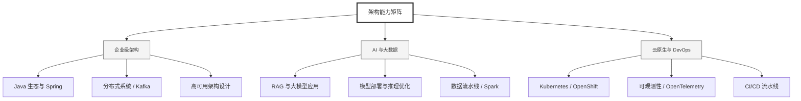

  <h1>你好，我是 Ellen Liu 👋</h1>
  

    <a href="README.md">English</a> | 
    <b>简体中文</b>
  

## 🧠 技术栈与核心能力

智能化企业系统建设路线图，涵盖全栈人工智能工程、云基础设施架构及模型部署等核心技术领域。

```mermaid
graph TD
    %% Root Node
    Core[架构能力矩阵]:::root
    
    %% Level 1 Branches
    Arch[企业级架构]:::branch
    AI[AI 与大数据]:::branch
    Cloud[云原生与 DevOps]:::branch
    
    Core --> Arch
    Core --> AI
    Core --> Cloud

    %% Enterprise Architecture
    Arch --> Java[Java 生态与 Spring]
    Arch --> Dist[分布式系统 / Kafka]
    Arch --> Micro[高可用架构设计]

    %% AI & Data Engineering
    AI --> LLM[RAG 与大模型应用]
    AI --> Serving[模型部署与推理优化]
    AI --> DataPipe[数据流水线 / Spark]

    %% Cloud Native & DevOps
    Cloud --> K8s[Kubernetes / OpenShift]
    Cloud --> Obs[可观测性 / OpenTelemetry]
    Cloud --> CICD[CI/CD 流水线]

    %% Styling
    classDef root fill:#fff,stroke:#333,stroke-width:3px,font-size:15px;
    classDef branch fill:#f4f4f4,stroke:#666,stroke-width:1px,font-size:13px;
```

## 🚀 Highlighted 工作

- **开源 AI 项目**: [基于 BERT 的声明检测模型](https://huggingface.co/XiaojingEllen/bert-finetuned-claim-detection) (Apache-2.0)
  - *已被哥伦比亚大学 (UBC) 研究项目引用。*
  - *手写 Transformer 核心代码，以验证理论与工程的一致性。*
- **金融基础设施**: 从 0 到 1 构建数字银行支付中间件及智能保险理赔系统。

## 📑 每日论文速递 (ArXiv)
<!-- DAILY_ARXIV_SUMMARY_START -->
**更新日期: 2026-08-19**

### 1. [ClawGym II：探索智能体框架上的黑盒强化学习](http://arxiv.org/abs/2608.16798v1)
- **摘要**: Agent 工具链（harnesses）通过协调智能体与环境的交互，显著提升了长时程任务的性能。然而，通过复杂工具链进行强化学习仍 largely 未被探索，因为将此类训练扩展到长时程智能体任务会引入根本性挑战。在本工作中，我们提出了一种统一的黑盒强化学习框架，用于通过复杂工具链对通用智能体进行稳定且可扩展的优化。具体而言，我们首先构建了一个基于沙箱的执行基础设施，将任务环境和工具链隔离在临时沙箱中，以支持大规模并发回滚。然后，我们将策略优化与不透明的工具链执行解耦，并在模型边界放置一个服务代理以捕获模型调用。为了重建多轮轨迹并提高训练效率，我们将捕获的调用组织成前缀树，并进一步调整基于评论家的 PPO 和无评论家的 GRPO，以优化恢复出的树结构。同时，我们在整个优化过程中保持训练与推理的一致性。最后，我们引入了混合工具链训练，允许单个模型通过异构工具链进行联合优化。使用 Qwen3-30A3B，黑盒强化学习在 ClawGym-Bench 上通过 OpenClaw 和 Claude Code 分别将 Pass@1 提升了 9.98 和 14.81 个百分点，同时在 200-400 个优化步骤中保持稳定性。此外，该框架在更具挑战性的任务（如 JobBench 和 OfficeQA）上也取得了一致的性能提升。总体而言，我们的框架通过黑盒工具链实现了对通用智能体的有效、稳定且可扩展的优化，并支持跨异构执行系统的统一训练。

### 2. [神经符号具身智能体](http://arxiv.org/abs/2608.16794v1)
- **摘要**: 语言和视觉-语言模型能够生成看似合理的具身计划，但并不能保证其可执行性，因为它们的输出可能违反环境动态或作用于错误接地（grounded）的实体。我们提出了一种神经符号代理（neuro-symbolic agent），将长时程家庭任务分解为任务导向的视觉探索和受约束的符号规划。在第一阶段，视觉-语言模型与探索机制从自我中心观察和接地交互中获取与目标相关的谓词和实例绑定，从而生成符号初始状态。在第二阶段，一个PDDL转移模型将解码限制为仅扩展可执行动作的令牌。随后，蒙特卡洛树搜索使用领域无关的规划启发式评估可执行的延续方案。由此产生的计划在转移模型下按构造即可执行，其对环境的迁移取决于正确的视觉接地。在VirtualHome和ALFWorld上，开放的4B-27B模型在两个环境中均超过90%的成功率，而我们最小的代理在每个环境中都显著优于27B直接视觉策略。约束与搜索被证明是互补而非可互换的：在ALFWorld中，单独使用任一方法仅能解决不到三分之一的任务，而两者结合可解决超过95%的任务。该方法生成的令牌数比扩展思维少数倍，模型可见图像数也远少于直接交互，且残余失败定位于状态获取而非计划生成，无需任何专门训练。

### 3. [语义强盗问题：上下文中的探索-利用受语义先验偏差影响](http://arxiv.org/abs/2608.16707v1)
- **摘要**: 大型语言模型（LLMs）正日益被部署为需要在复杂环境探索中进行决策的智能体。然而，现有研究已对LLMs如何实际平衡探索与利用提出了疑问。与经典智能体不同，LLM智能体通过自然语言与任务互动，使其接触到任务结构中无正式对应物的语义信息。我们引入了语义老虎机（semantic bandit），这是多臂老虎机设置的一种扩展，明确考虑了分配给动作的文本标签，并利用它来研究语义先验——即预训练期间语言与预期奖励之间关联所产生的归纳偏差——如何塑造LLM的探索行为。我们发现，语义信息丰富的动作标签减少了探索，转而偏向利用，当这些标签与奖励结构一致时能提升性能，而在不一致时则严重降低性能。我们还发现，负面奖励比同等程度的正面奖励引发显著更多的探索，这与预训练数据中常见奖励惯例所导致的预期规模偏差一致。总体而言，我们认为，使用语言来定义环境和奖励不可避免地引入了源于模型基于词共现训练的偏差，这对LLM智能体在现实决策场景中的可靠性和稳健性具有重要影响。

<!-- DAILY_ARXIV_SUMMARY_END -->

## 🌐 保持联系

  
<i>期待与您探讨 AI 基础设施的未来！</i>

