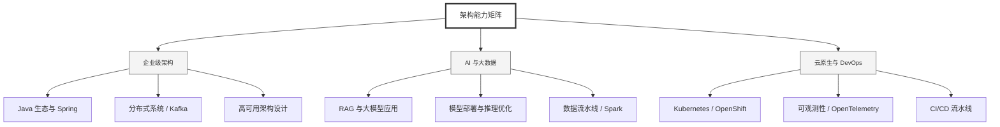

  <h1>你好，我是 Ellen Liu 👋</h1>
  

    <a href="README.md">English</a> | 
    <b>简体中文</b>
  

## 🧠 技术栈与核心能力

智能化企业系统建设路线图，涵盖全栈人工智能工程、云基础设施架构及模型部署等核心技术领域。

```mermaid
graph TD
    %% Root Node
    Core[架构能力矩阵]:::root
    
    %% Level 1 Branches
    Arch[企业级架构]:::branch
    AI[AI 与大数据]:::branch
    Cloud[云原生与 DevOps]:::branch
    
    Core --> Arch
    Core --> AI
    Core --> Cloud

    %% Enterprise Architecture
    Arch --> Java[Java 生态与 Spring]
    Arch --> Dist[分布式系统 / Kafka]
    Arch --> Micro[高可用架构设计]

    %% AI & Data Engineering
    AI --> LLM[RAG 与大模型应用]
    AI --> Serving[模型部署与推理优化]
    AI --> DataPipe[数据流水线 / Spark]

    %% Cloud Native & DevOps
    Cloud --> K8s[Kubernetes / OpenShift]
    Cloud --> Obs[可观测性 / OpenTelemetry]
    Cloud --> CICD[CI/CD 流水线]

    %% Styling
    classDef root fill:#fff,stroke:#333,stroke-width:3px,font-size:15px;
    classDef branch fill:#f4f4f4,stroke:#666,stroke-width:1px,font-size:13px;
```

## 🚀 Highlighted 工作

- **开源 AI 项目**: [基于 BERT 的声明检测模型](https://huggingface.co/XiaojingEllen/bert-finetuned-claim-detection) (Apache-2.0)
  - *已被哥伦比亚大学 (UBC) 研究项目引用。*
  - *手写 Transformer 核心代码，以验证理论与工程的一致性。*
- **金融基础设施**: 从 0 到 1 构建数字银行支付中间件及智能保险理赔系统。

## 📑 每日论文速递 (ArXiv)
<!-- DAILY_ARXIV_SUMMARY_START -->
**更新日期: 2026-09-07**

### 1. [面向建筑能源系统中暖通空调运维的大语言模型：方法、应用与部署就绪度的批判性综述](http://arxiv.org/abs/2609.05314v1)
- **摘要**: 建筑自动化系统生成了丰富的传感器数据，但由于异构点命名、缺失元数据和碎片化文档，这些数据在运营使用中仍缺乏洞察力。本系统综述分析并编码了2023年至2026年3月间发表的66篇关于大型语言模型（LLMs）用于暖通空调（HVAC）运营的同行评审研究。每项研究按五个应用族和三个LLM方法族进行分类，并评估证据真实性、部署就绪度以及LLM与物理HVAC决策之间的责任边界。该语料库集中于建筑能耗建模（BEM，66篇中占32篇），而负荷预测领域研究过于稀疏，难以得出子领域级结论。仅有四项研究达到试点级证据水平，且无研究报告持续运营部署。没有研究被归类为可立即用于行业采用；三项为近期可行，其余63项仅限研究阶段。尽管如此，若干有界且人在回路中的用途值得近期试验，包括点名称规范化、基于文档的运维支持、BEM工作流辅助以及围绕基于物理的控制器提供咨询界面。传统机器学习（ML）、模型预测控制（MPC）、强化学习（RL）和基于本体的工具在高频控制、短时域数值预测和适定本体映射方面仍更受青睐，而自主智能体操作和未经验证的居住者代理仍处于研究阶段。因此，当前证据支持LLMs主要作为语义和工作流层，而非自主HVAC控制器。未来工作应优先考虑现场验证基准、运营约束下的编排评估，以及具有有界延迟和可验证安全属性的LLM-MPC/RL架构。

### 2. [一种基于验证器引导的可解释推理框架，融合金标锚定QLoRA、任务感知专家混合与分组相对RLVR](http://arxiv.org/abs/2609.05221v1)
- **摘要**: 大型语言模型（LLMs）展现出强大的推理能力，但其解释可能仍存在不一致、依据薄弱或难以验证的问题。我们提出了一种验证器引导的可解释推理框架，用于透明的教育问答，该框架结合了黄金锚定QLoRA、任务感知符号路由和群体相对RLVR。首先，使用领域加权QLoRA监督，锚定到权威答案，对Qwen2.5-3B-Instruct进行适配。随后，一个轻量级路由器将逻辑问题分配给FOL/Z3验证器，并将物理问题分配给公式和单位感知的符号求解器。验证器反馈进一步用于支持候选评估、自我修订以及RLVR过程中的奖励构建。候选回答沿三个互补维度进行评估：P1用于答案正确性，P2用于证据或单位一致性，P3用于推理深度和可解释性。在推理时，无黄金标准的自一致性聚合多个候选回答，随后一个仅基于问题的物理验证器执行保守的系统级修正。在438个保留示例上，RLVR将P3从50.68%提升至72.20%，而混合P1保持在大约55.94%的稳定水平。自一致性将仅模型P1从48.86%提升至50.23%，符号验证则提供了剩余的混合增益。这些结果表明，RLVR主要增强了显式推理结构，而符号验证通过提高系统级的答案可靠性，对神经策略形成补充。

### 3. [大型语言模型能否预测社会政策的行为反应？——以中国灵活就业人员养老金参保预测为例](http://arxiv.org/abs/2609.05189v1)
- **摘要**: 评估社会政策变化的影响，是政策制定者公认的一大挑战。当计量经济学方法被用于推断假设性情境时，可能并不可靠，而实地试点项目则成本高昂。在本文中，我们提出使用大型语言模型（LLMs）作为政策评估工具，这些模型由通用模型改造而来。我们介绍了FlexPension-LLM，这是首个面向中国灵活就业人员层级式养老金参保预测任务的专业化大型语言模型，并引入了DKI-RDistill方法，该方法将基于政策的线索注入提示中，包括基于Probit模型的边际效应以及户籍所在地的养老金规定。该方法随后利用LoRA/SFT技术，将带有推理增强的监督信号提炼至一个开放权重的混合专家（MoE）学生模型中，并通过在真实标签下重新生成错误案例来纠正教师模型的错误。在CHFS 2019盲测集上，FlexPension-LLM取得了0.9316的综合F1分数，超越了其教师模型Claude Sonnet 4.5以及17个基线中的15个，并且与Claude Opus 4.6在统计上无显著差异。在四项外部调查中，其平均综合F1分数为0.7549，并且在最强系统中表现出最窄的性能波动范围。组件分析表明，性能提升主要来源于基于政策的线索注入和错误过滤的监督信号，而推理过程则提供了可与政策规则核对的决策轨迹。

<!-- DAILY_ARXIV_SUMMARY_END -->

## 🌐 保持联系

  
<i>期待与您探讨 AI 基础设施的未来！</i>

