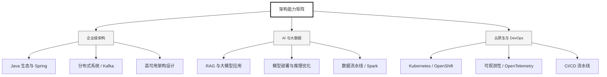

  <h1>你好，我是 Ellen Liu 👋</h1>
  

    <a href="README.md">English</a> | 
    <b>简体中文</b>
  

## 🧠 技术栈与核心能力

智能化企业系统建设路线图，涵盖全栈人工智能工程、云基础设施架构及模型部署等核心技术领域。

```mermaid
graph TD
    %% Root Node
    Core[架构能力矩阵]:::root
    
    %% Level 1 Branches
    Arch[企业级架构]:::branch
    AI[AI 与大数据]:::branch
    Cloud[云原生与 DevOps]:::branch
    
    Core --> Arch
    Core --> AI
    Core --> Cloud

    %% Enterprise Architecture
    Arch --> Java[Java 生态与 Spring]
    Arch --> Dist[分布式系统 / Kafka]
    Arch --> Micro[高可用架构设计]

    %% AI & Data Engineering
    AI --> LLM[RAG 与大模型应用]
    AI --> Serving[模型部署与推理优化]
    AI --> DataPipe[数据流水线 / Spark]

    %% Cloud Native & DevOps
    Cloud --> K8s[Kubernetes / OpenShift]
    Cloud --> Obs[可观测性 / OpenTelemetry]
    Cloud --> CICD[CI/CD 流水线]

    %% Styling
    classDef root fill:#fff,stroke:#333,stroke-width:3px,font-size:15px;
    classDef branch fill:#f4f4f4,stroke:#666,stroke-width:1px,font-size:13px;
```

## 🚀 Highlighted 工作

- **开源 AI 项目**: [基于 BERT 的声明检测模型](https://huggingface.co/XiaojingEllen/bert-finetuned-claim-detection) (Apache-2.0)
  - *已被哥伦比亚大学 (UBC) 研究项目引用。*
  - *手写 Transformer 核心代码，以验证理论与工程的一致性。*
- **金融基础设施**: 从 0 到 1 构建数字银行支付中间件及智能保险理赔系统。

## 📑 每日论文速递 (ArXiv)
<!-- DAILY_ARXIV_SUMMARY_START -->
**更新日期: 2026-10-06**

### 1. [面向智能体机器人的递归视频上下文学习](http://arxiv.org/abs/2610.06843v1)
- **摘要**: 编排冻结视觉-语言-动作（VLA）策略的LLM智能体通过文本记忆在多个回合中不断改进，而文本记忆记录的是智能体做了什么，而非任务是如何完成的。演示视频能展示任务如何完成，却难以融入智能体的上下文。完整视频会拖慢每一次回合，固定关键帧会丢失决定抓取能否保持的接触细节，而智能体所需的信息会从规划时的任务结构转变为每次接触前后的帧。我们提出递归视频上下文学习（RV-ICL），一种无需训练的方法，它将演示转化为智能体可导航的层级结构，而非智能体被动接收的提示。该层级结构由演示的子事件构建，例如抓取和释放。其层级逐级细化，从整个任务的关键帧到阶段、时刻和短片段，并通过只读工具暴露。智能体在规划前读取粗粒度层级。在执行过程中，当某一步需要更多细节时，它会重新进入该层级，并仅加载其当前子目标的片段。每个任务只需一个演示。基于RPent，RV-ICL在LIBERO-PRO上将成功率从92.6%提升至96.5%，在LIBERO-Plus上从86.7%提升至95.8%。

### 2. [MemPilot：为LLM代理编排按需多模态记忆策展](http://arxiv.org/abs/2610.06830v1)
- **摘要**: 记忆已成为大语言模型智能体生态中不可或缺的组成部分，支撑着跨交互的信息保留与复用。然而，现有大多数智能体记忆系统以与查询无关的方式构建记忆，这可能导致不必要的预处理开销，并丢弃后续被证明至关重要的细节。近期研究已开始将记忆处理转向运行时自适应，但通常局限于特定操作或固定处理方案，对性能、成本与延迟的灵活控制仍 largely 未被充分探索。为应对这一挑战，我们提出 \textbf{MemPilot}，一个灵活的框架，能够在不同性能—成本—延迟偏好下按需编排记忆整理。具体而言，我们通过强化学习优化一个多步大语言模型策略，使其在从查询无关记忆中检索与将查询特定的原始多模态历史整理任务委派给异构大语言模型和视觉语言模型之间迭代选择。该策略联合控制证据量、整理指令、模型选择和视觉访问，从而实现运行时计算的细粒度分配。为在相互竞争的目标下优化该策略，我们采用目标维度优势解耦，在聚合前分别估计每个目标的优势。此外，我们引入基于前缀的边际效用估计，以实现多步 rollout 中的细粒度信用分配。在五个多模态智能体记忆基准上的实验表明，在不同优化偏好下均能取得良好的性能—成本—延迟权衡，且偏好扫描所得到的前沿比现有权衡感知基线更广。

### 3. [CLIFT：用于网络代理训练和测试时扩展的共形自验证](http://arxiv.org/abs/2610.06829v1)
- **摘要**: 开源网络智能体如今已足够强大，能够执行真实的浏览器任务，但用强化学习训练它们仍然依赖于弱监督：二元任务成功信号过于稀疏，难以进行信用分配；而前沿语言模型评判器调用成本过高，无法在每一步都使用，也不能假定在部署时可用。我们提出 CLIFT，一种围绕保形自验证构建的训练与测试时扩展方法。在训练期间，智能体针对自身 rollout 回答自然语言验证问题；组合保形认证器只保留其 URL 条件证据与训练时评判器一致的问题信号，通过极性感知提升分配带符号信任权重，并将所得验证器分数以绝不从评判器基线中扣减的方式融入每步奖励。在测试时，同一认证问题库被冻结并复用为保形轨迹选择（CTS）的结构化证据：智能体采样一个贪心 rollout 以及一个或多个多样化重试，自验证器总结每个 URL 轨迹，保守多数投票规则决定是否从当前 incumbent 切换，而无需调用任何外部评判器。这一单一机制支持三种设置。在 WebArena Infinity 上，CLIFT 在开源网络智能体中达到最先进性能。在 VisualWebArena 上，用开放模型训练的问题库在测试时迁移到 GPT-5.5，并在规范测试框架下达到最先进性能。在 Online Mind2Web 上，无需在基准上训练智能体，迁移认证问题库即可在零样本评估中改进实时网络智能体。这些结果共同表明，保形自验证是一种将昂贵的评判器反馈转化为可复用训练信号和无评判器测试时扩展信号的方法。

<!-- DAILY_ARXIV_SUMMARY_END -->

## 🌐 保持联系

  
<i>期待与您探讨 AI 基础设施的未来！</i>

