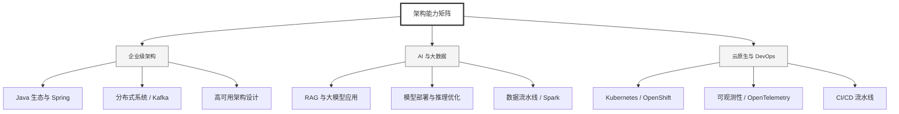

  <h1>你好，我是 Ellen Liu 👋</h1>
  

    <a href="README.md">English</a> | 
    <b>简体中文</b>
  

## 🧠 技术栈与核心能力

智能化企业系统建设路线图，涵盖全栈人工智能工程、云基础设施架构及模型部署等核心技术领域。

```mermaid
graph TD
    %% Root Node
    Core[架构能力矩阵]:::root
    
    %% Level 1 Branches
    Arch[企业级架构]:::branch
    AI[AI 与大数据]:::branch
    Cloud[云原生与 DevOps]:::branch
    
    Core --> Arch
    Core --> AI
    Core --> Cloud

    %% Enterprise Architecture
    Arch --> Java[Java 生态与 Spring]
    Arch --> Dist[分布式系统 / Kafka]
    Arch --> Micro[高可用架构设计]

    %% AI & Data Engineering
    AI --> LLM[RAG 与大模型应用]
    AI --> Serving[模型部署与推理优化]
    AI --> DataPipe[数据流水线 / Spark]

    %% Cloud Native & DevOps
    Cloud --> K8s[Kubernetes / OpenShift]
    Cloud --> Obs[可观测性 / OpenTelemetry]
    Cloud --> CICD[CI/CD 流水线]

    %% Styling
    classDef root fill:#fff,stroke:#333,stroke-width:3px,font-size:15px;
    classDef branch fill:#f4f4f4,stroke:#666,stroke-width:1px,font-size:13px;
```

## 🚀 Highlighted 工作

- **开源 AI 项目**: [基于 BERT 的声明检测模型](https://huggingface.co/XiaojingEllen/bert-finetuned-claim-detection) (Apache-2.0)
  - *已被哥伦比亚大学 (UBC) 研究项目引用。*
  - *手写 Transformer 核心代码，以验证理论与工程的一致性。*
- **金融基础设施**: 从 0 到 1 构建数字银行支付中间件及智能保险理赔系统。

## 📑 每日论文速递 (ArXiv)
<!-- DAILY_ARXIV_SUMMARY_START -->
**更新日期: 2026-10-10**

### 1. [WOVEN：将视觉世界建模编织进多模态大型语言模型](http://arxiv.org/abs/2610.12417v1)
- **摘要**: 多模态大语言模型（MLLMs）在空间、具身、物理和时间推理方面表现不佳。我们假设这些失败反映了视觉过渡推理中的共同缺陷，并检验这种能力能否作为一种共享的训练原语——不同模型可以从不同监督来源学习，并在不同任务间复用，且配有一套系统化的训练方法。现有基准分别记录了这些缺陷，但不支持跨场景、动作和推理操作的受控比较。因此，我们提出WOVEN，一个用于视觉过渡推理的训练来源和基准，它按场景、动作和推理类型组织过渡监督，使用来自视频预训练生成模型的多样、真实推演：涵盖20种场景类型、5种动作类型和8种推理类型的36,076个示例。我们首先评估了38个前沿MLLM（例如GPT-5.4和Qwen3-VL-235B-A22B），发现了一个显著且系统性的缺陷：即使是最强的模型也远低于人类水平，而且这些失败在不同模型家族中反复出现，并随规模扩大而持续存在。随后，我们在WOVEN上训练了多个规模的MLLM，发现它们学到了一种可广泛迁移的共享能力：每个仅约2,000项的较小子集共同将26个外部基准中的22个提升了最多27.3个百分点，并且WOVEN数据可以替代某任务自身30-50%的训练数据，同时保持相当的准确率。受控比较进一步得出了视觉世界建模的训练方法，并在留出基准上进行了前瞻性验证：根据监督所教授的推理操作来选择监督，而不是根据它展示的动作、场景或领域来选择；并且优先选择视觉状态变化更大的样本以提升鲁棒性。我们的工作确立了视觉过渡推理作为MLLM中系统化视觉世界模型训练的可复用基础。

### 2. [用价值表示预测对齐泛化](http://arxiv.org/abs/2610.12410v1)
- **摘要**: LLM开发者通过后训练使模型展现出亲社会价值观和行为特征，这些在对齐目标中被逐一列举。然而，尽管近期的后训练进展已使模型在对齐评估中获得高分，但在狭窄行为集上训练模型仍会以意想不到的方式影响其在未见情境和环境中的行为。本文确立了“对齐泛化预测”这一任务，即预测将模型微调以遵循某一给定价值观后，其行为在广泛留出价值观上的变化。我们对现代对齐目标中66种价值观的对齐泛化效应进行了大规模分析，并在对齐泛化预测任务上对表征技术进行了基准测试。我们发现，基于模型在上下文中应用价值观时的激活的表征，显著优于基于价值观文本描述的方法。具体而言，最佳基于激活的方法与我们的泛化矩阵达到0.45的相关性，而基于描述的基线仅为0.05。随后，我们展示了预测对齐泛化的表征在下游任务中的适用性：利用它们衡量多价值观对齐目标中各价值观之间的相似程度，并发现这与模型鲁棒性显著相关。最后，我们展示了朝向一个共享的、与模型无关的价值观空间的初步证据，并据此开发了首个基于经验泛化动态的LLM价值观分类体系。我们的工作表明，研究LLM中的价值观泛化及其在更经验化的模型行为设计与训练中的应用具有重要意义。

### 3. [ViSkill：以演化式视觉原生技能强化VLM智能体](http://arxiv.org/abs/2610.12403v1)
- **摘要**: 技能增强型智能体通过将成功轨迹提炼为可复用策略来提升样本效率。然而，现有方法大多仍以文本为中心，将空间布局和动作-状态对应关系线性化为语言，从而丢失了关键的几何结构。近期研究已开始引入视觉证据，但其技能构建与更新独立于策略优化，二者相互促进的潜力尚未被充分探索。我们提出ViSkill，一种视觉原生的技能学习框架，将成功交互编码为复合视觉技能卡，供VLM智能体直接访问。检索到的技能同时指导推理和奖励塑形，而成功轨迹则被提炼回技能库，形成闭环反馈，使技能积累与策略改进相互强化。可选的冷启动机制进一步加速早期学习。在Sokoban、FrozenLake和PrimitiveSkill上的评估表明，ViSkill总体成功率达到0.89，结合冷启动初始化后提升至0.91，优于所有评估的专有和开源基线，且收敛速度快于标准PPO。我们的代码可在https://github.com/ZJU-REAL/ViSkill获取。

<!-- DAILY_ARXIV_SUMMARY_END -->

## 🌐 保持联系

  
<i>期待与您探讨 AI 基础设施的未来！</i>

