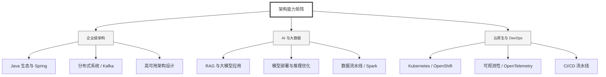

  <h1>你好，我是 Ellen Liu 👋</h1>
  

    <a href="README.md">English</a> | 
    <b>简体中文</b>
  

## 🧠 技术栈与核心能力

智能化企业系统建设路线图，涵盖全栈人工智能工程、云基础设施架构及模型部署等核心技术领域。

```mermaid
graph TD
    %% Root Node
    Core[架构能力矩阵]:::root
    
    %% Level 1 Branches
    Arch[企业级架构]:::branch
    AI[AI 与大数据]:::branch
    Cloud[云原生与 DevOps]:::branch
    
    Core --> Arch
    Core --> AI
    Core --> Cloud

    %% Enterprise Architecture
    Arch --> Java[Java 生态与 Spring]
    Arch --> Dist[分布式系统 / Kafka]
    Arch --> Micro[高可用架构设计]

    %% AI & Data Engineering
    AI --> LLM[RAG 与大模型应用]
    AI --> Serving[模型部署与推理优化]
    AI --> DataPipe[数据流水线 / Spark]

    %% Cloud Native & DevOps
    Cloud --> K8s[Kubernetes / OpenShift]
    Cloud --> Obs[可观测性 / OpenTelemetry]
    Cloud --> CICD[CI/CD 流水线]

    %% Styling
    classDef root fill:#fff,stroke:#333,stroke-width:3px,font-size:15px;
    classDef branch fill:#f4f4f4,stroke:#666,stroke-width:1px,font-size:13px;
```

## 🚀 Highlighted 工作

- **开源 AI 项目**: [基于 BERT 的声明检测模型](https://huggingface.co/XiaojingEllen/bert-finetuned-claim-detection) (Apache-2.0)
  - *已被哥伦比亚大学 (UBC) 研究项目引用。*
  - *手写 Transformer 核心代码，以验证理论与工程的一致性。*
- **金融基础设施**: 从 0 到 1 构建数字银行支付中间件及智能保险理赔系统。

## 📑 每日论文速递 (ArXiv)
<!-- DAILY_ARXIV_SUMMARY_START -->
**更新日期: 2026-09-28**

### 1. [通过信念自蒸馏进行用户模型提取](http://arxiv.org/abs/2609.31603v1)
- **摘要**: 大型语言模型（LLM）会隐式推断其用户的属性并据此调整行为，但这些信念仍然难以被检视和因果性地操控。我们提出了信念自蒸馏（BSD），这是一个统一的读写框架，通过线性探测与因果探测之间的桥梁，学习一种紧凑的用户表征，该表征既可被解码，也可被写回模型。冻结的LLM充当自身的教师，在没有外部标注的情况下从自然对话中蒸馏信念。与传统探测不同，BSD不仅分离出激活中存在的信念信息，还分离出一种其因果作用可以被直接检验的状态。在多个模型系列中，BSD忠实地恢复了用户信念，并实现了比匹配的隐藏状态引导显著更强的干预效果。至关重要的是，我们发现拒绝不仅取决于请求本身，还取决于模型推断出的用户意图：在保持请求不变的情况下改变这一信念会改变拒绝行为。我们进一步揭示了一个引人注目的跨模型规律：独立训练的LLM在表征其用户时收敛到一种共享的几何结构。这些结果共同表明，隐式用户模型是可读且可因果写入的内部状态，对AI安全具有直接影响，塑造了模型如何根据它们认为自己正在与谁交互来调节安全决策。

### 2. [面向编码智能体的紧凑文档：一个基准、一个优化器，以及为何它无法迁移](http://arxiv.org/abs/2609.31587v1)
- **摘要**: 我们研究自然语言文档是否有助于编码代理解决软件问题，并构建用于构造和评估此类文档的工具。我们引入了一种往返基准，通过由代码描述重新生成的代码能否通过原始测试来对其评分，并表明决定描述保真度的是完整性而非长度。以该基准作为优化信号，我们发现了一种描述撰写提示，能够达到完全保真度并泛化到未见文件。随后，我们检验了促使这项工作的假设：更好的文档有助于代理解决真实代码仓库中的问题。跨两个模型家族和十个代码仓库，并以阳性对照确认我们的评估能够检测到真实改进，我们发现事实并非如此。当源代码存在时，无论是静态紧凑文档还是检索到的上下文，都不如仅提供问题本身。我们报告这一负面结果，并同时给出基准和优化器，还刻画了文档能够提供帮助的边界。

### 3. [用于自训练的策略性多样化采样](http://arxiv.org/abs/2609.31571v1)
- **摘要**: 许多大语言模型的训练与推理方法，包括强化学习和测试时扩展，都依赖于重复采样，但只有当响应存在有意义的差异时才会受益。自训练也面临同样的挑战：训练数据通常通过采样独立同分布响应并主要按正确性进行筛选来构建，从而过度代表了模型已经偏好的策略。我们将策略多样性，即解决问题方法之间的实质性差异，作为构建自训练数据的一种替代原则加以研究。我们通过两种采样方法生成策略多样化的数据：GROOT，一种构建方法层次树并采样不同路径的新方法；以及言语化采样，经调整后可生成无结构的方法集合。在竞赛编程和下一章预测领域，基于策略多样化数据训练的模型在困难任务上优于独立同分布训练的对应模型，并为强化学习和测试时扩展提供了强有力的初始化。最引人注目的是，基于Qwen3-4B生成的策略多样但不正确的轨迹进行自训练，其效果优于从235B教师模型进行的独立同分布蒸馏。这些结果挑战了关于什么使自训练数据有用的主流假设，并表明方法的多样性可能比正确性或教师规模更为重要。

<!-- DAILY_ARXIV_SUMMARY_END -->

## 🌐 保持联系

  
<i>期待与您探讨 AI 基础设施的未来！</i>

