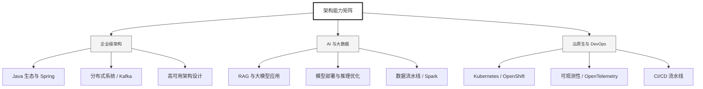

  <h1>你好，我是 Ellen Liu 👋</h1>
  

    <a href="README.md">English</a> | 
    <b>简体中文</b>
  

## 🧠 技术栈与核心能力

智能化企业系统建设路线图，涵盖全栈人工智能工程、云基础设施架构及模型部署等核心技术领域。

```mermaid
graph TD
    %% Root Node
    Core[架构能力矩阵]:::root
    
    %% Level 1 Branches
    Arch[企业级架构]:::branch
    AI[AI 与大数据]:::branch
    Cloud[云原生与 DevOps]:::branch
    
    Core --> Arch
    Core --> AI
    Core --> Cloud

    %% Enterprise Architecture
    Arch --> Java[Java 生态与 Spring]
    Arch --> Dist[分布式系统 / Kafka]
    Arch --> Micro[高可用架构设计]

    %% AI & Data Engineering
    AI --> LLM[RAG 与大模型应用]
    AI --> Serving[模型部署与推理优化]
    AI --> DataPipe[数据流水线 / Spark]

    %% Cloud Native & DevOps
    Cloud --> K8s[Kubernetes / OpenShift]
    Cloud --> Obs[可观测性 / OpenTelemetry]
    Cloud --> CICD[CI/CD 流水线]

    %% Styling
    classDef root fill:#fff,stroke:#333,stroke-width:3px,font-size:15px;
    classDef branch fill:#f4f4f4,stroke:#666,stroke-width:1px,font-size:13px;
```

## 🚀 Highlighted 工作

- **开源 AI 项目**: [基于 BERT 的声明检测模型](https://huggingface.co/XiaojingEllen/bert-finetuned-claim-detection) (Apache-2.0)
  - *已被哥伦比亚大学 (UBC) 研究项目引用。*
  - *手写 Transformer 核心代码，以验证理论与工程的一致性。*
- **金融基础设施**: 从 0 到 1 构建数字银行支付中间件及智能保险理赔系统。

## 📑 每日论文速递 (ArXiv)
<!-- DAILY_ARXIV_SUMMARY_START -->
**更新日期: 2026-09-29**

### 1. [语言模型内省机制的机理研究](http://arxiv.org/abs/2609.35108v1)
- **摘要**: 大型语言模型（LLMs）有时能够报告其内部激活所受到的扰动——即便输入中并无证据表明发生了干预。模型是如何检测并定位此类内部变化的？我们通过一个保持输入文本不变的可控任务来研究这一问题。我们要么在十个词元位置之一的隐藏状态中注入一个概念向量，要么不施加任何干预。模型被要求识别被扰动的位置，或报告未发生干预。在三个模型家族中，我们识别出两小组注意力头，它们在内省报告中具有不同作用。中间层的门控头影响模型是否报告变化，而较后层中的路由头则有助于选择要报告的位置。对门控头进行干预，即使路由头提供了位置信息，也可能抑制位置报告。我们进一步研究了为何报告准确率在不同概念间存在差异。定位更准确的概念向量会在门控头中产生更强的注意力分数和输出响应，这与其QK和OV计算中诱导的键和值变化具有更好的一致性相关。总之，这些发现识别了支持内省检测与定位的注意力头机制。

### 2. [当信心过早上升：通过过早答案承诺检测捷径推理](http://arxiv.org/abs/2609.35074v1)
- **摘要**: 大型语言模型（LLM）的推理轨迹通常被视为其内部推理的语言化描述。然而，这类轨迹可能并不忠实：模型可能依赖捷径得出答案，然后用看似连贯的思维链对这一决定进行事后合理化。检测这种捷径推理颇具挑战，因为现有的监测器和验证器主要检查文本痕迹或最终结果，而非模型在生成过程中对其答案的信念如何演变。我们提出ConfLens，一个追踪推理全过程中最终答案置信度演变的框架。在三种捷径推理设置下，我们观察到一种过早自信的常见模式，即捷径样本在推理早期阶段就对最终答案表现出高置信度。然而，现有置信度估计方法在检测这一行为时，其泛化性、可靠性或效率均有限。因此，我们提出分布性答案承诺分数（DACS），一种分布性置信度估计器，用于测量模型在每个推理步骤对答案承诺的概率分布的熵。DACS无需真实答案或任务特定验证器，即可捕捉模型答案信念的集中程度。我们进一步将ConfLens的检测结果转化为奖励模型的可解释信号，以减少其对捷径推理的偏好。在数学和代码推理任务上的实验表明，结合DACS的ConfLens相比强基线将捷径推理检测的F1提升超过4.3%，并减少了奖励模型偏好中忠实性与正确性之间的不匹配。

### 3. [行为回响：道德历史可以塑造和引导大型语言模型的行为选择](http://arxiv.org/abs/2609.35070v1)
- **摘要**: 大型语言模型（LLM）的道德评估通常孤立地考察决策，因而忽视了个体先前无关行为是否会影响模型的后续选择。这使得道德历史是否以及以何种程度塑造LLM决策行为的问题悬而未决。关于人类道德决策的既有研究表明，过去的行为能够影响后续的道德选择。基于这一观察，我们从两个互补层面探究LLM中是否出现类似效应：在行为层面，通过模型可观察的响应；在表征层面，通过其潜在内部表征。我们提出MoralLedger，一个用于研究行为主体的道德历史如何在固定决策情境下塑造LLM行为动作的框架。在行为层面，我们发现先前的道德历史会依据其效价和强度系统性地改变后续选择。在内部表征层面，这些历史在残差流中诱导出一个可线性恢复的方向，且该方向能泛化到留出样本。沿该方向对中性历史提示进行干预，会在后续选择中产生双向的、强度依赖的变化，其效应强于仅通过提示或通过有利的非道德方向所诱导的效应。据我们所知，这是首次证明行为主体先前道德操守的潜在表征能够对道德决策提供有符号的推理时控制。我们的MoralLedger将道德评估扩展到静态困境之外，确立道德历史既是行为敏感性的来源，也是审计和控制LLM道德行为的因果靶点。

<!-- DAILY_ARXIV_SUMMARY_END -->

## 🌐 保持联系

  
<i>期待与您探讨 AI 基础设施的未来！</i>

