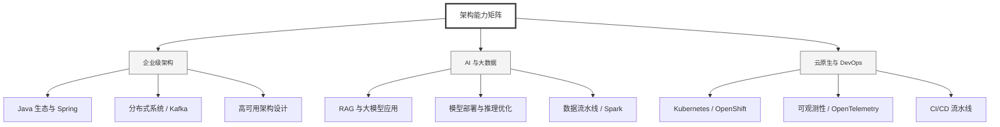

  <h1>你好，我是 Ellen Liu 👋</h1>
  

    <a href="README.md">English</a> | 
    <b>简体中文</b>
  

## 🧠 技术栈与核心能力

智能化企业系统建设路线图，涵盖全栈人工智能工程、云基础设施架构及模型部署等核心技术领域。

```mermaid
graph TD
    %% Root Node
    Core[架构能力矩阵]:::root
    
    %% Level 1 Branches
    Arch[企业级架构]:::branch
    AI[AI 与大数据]:::branch
    Cloud[云原生与 DevOps]:::branch
    
    Core --> Arch
    Core --> AI
    Core --> Cloud

    %% Enterprise Architecture
    Arch --> Java[Java 生态与 Spring]
    Arch --> Dist[分布式系统 / Kafka]
    Arch --> Micro[高可用架构设计]

    %% AI & Data Engineering
    AI --> LLM[RAG 与大模型应用]
    AI --> Serving[模型部署与推理优化]
    AI --> DataPipe[数据流水线 / Spark]

    %% Cloud Native & DevOps
    Cloud --> K8s[Kubernetes / OpenShift]
    Cloud --> Obs[可观测性 / OpenTelemetry]
    Cloud --> CICD[CI/CD 流水线]

    %% Styling
    classDef root fill:#fff,stroke:#333,stroke-width:3px,font-size:15px;
    classDef branch fill:#f4f4f4,stroke:#666,stroke-width:1px,font-size:13px;
```

## 🚀 Highlighted 工作

- **开源 AI 项目**: [基于 BERT 的声明检测模型](https://huggingface.co/XiaojingEllen/bert-finetuned-claim-detection) (Apache-2.0)
  - *已被哥伦比亚大学 (UBC) 研究项目引用。*
  - *手写 Transformer 核心代码，以验证理论与工程的一致性。*
- **金融基础设施**: 从 0 到 1 构建数字银行支付中间件及智能保险理赔系统。

## 📑 每日论文速递 (ArXiv)
<!-- DAILY_ARXIV_SUMMARY_START -->
**更新日期: 2026-10-02**

### 1. [KaliBench：一个用于Kali Linux网络安全工具使用的细粒度基准，具有无需运行时即可验证的奖励](http://arxiv.org/abs/2610.02206v1)
- **摘要**: 大型语言模型（LLM）正越来越多地应用于网络安全工作流，人们期望它们能将分析师的意图转化为工具调用。然而，现有评估主要集中于基于知识的测评或端到端智能体任务，并未直接衡量LLM为真实网络安全工具生成可执行命令的能力。这一空白至关重要，因为网络安全操作依赖严格的命令行界面（CLI），其中细微的语法错误、错误的标志—值绑定或参数顺序错误都可能导致执行失败。我们提出KaliBench，一个用于Kali Linux上自然语言到CLI翻译的细粒度基准和数据集，包含8,504个查询—命令对，覆盖23个能力维度和5个安全阶段的1,642个工具。KaliBench通过基于手册的流水线构建，采用确定性规范化与别名感知评估，从而能够对工具选择和参数构造进行精确且可复现的评估。为确保语义正确性和实际可执行性，我们开发了一个多阶段验证流水线，结合基于LLM的验证、沙箱终端执行和人在回路细化。基于这些细粒度、确定性的信号，KaliBench进一步支持训练时的无运行时可验证奖励。在三种评估模式和24种通用及安全聚焦开放权重模型配置下，没有开放权重模型在无限制设置中超过42%的精确命令准确率，凸显了在没有明确工具提示的情况下准确使用基于CLI的网络安全工具的难度。我们进一步表明，使用KaliBench衍生的可验证奖励进行监督微调和强化学习，可显著提升一个8B模型，并达到与685B MoE模型相当的性能。

### 2. [ScholarCatalyst：一个用于检索激发新研究论文的基准](http://arxiv.org/abs/2610.02202v1)
- **摘要**: 是什么让伟大的科学家如此伟大？即便AI系统开始在开放问题上取得进展，科学家在感知一个新问题需要哪些先前想法方面仍远远领先于它们——这些想法深藏于不断增长的研究档案中。为了研究这一能力，我们借助那些 firsthand 知道哪些早期工作推进了其已完成项目的研究人员，论文则作为指向其中思想的指针。利用我们使作者标注可扩展的自动化流水线，我们构建了 ScholarCatalyst：让207篇近期计算机科学论文的184位主要作者标注哪些候选工作已经或本可以推进其项目，并为每项标注提供详细理由。我们引入一个带有作者提供判断的检索任务：给定一个初始研究问题，仅从项目开始时已有的文献中检索这些论文。Agentic search 的表现并不优于嵌入检索（0.42 vs. 0.48 Recall@20），尽管它将同一检索器作为工具调用。即使是一个基于 Claude Fable 5.1 构建的智能体——它可能在训练中见过这些已完成的论文——也只达到0.51 R@20。这些结果凸显出需要新的训练方法，使模型具备在广泛语料中搜索的专家直觉。我们将 ScholarCatalyst 设想为迈向科学智能体的一步，这些智能体能够从一个半成形的想法出发，指出其所需要的先前研究。

### 3. [AutoCompact：学习在长时程编程智能体中何时压缩上下文](http://arxiv.org/abs/2610.02163v1)
- **摘要**: 编码智能体通过代码检查、搜索、编辑和测试的长轨迹来解决仓库级软件工程任务。随着任务推进，早期的探索会变得过时，因此管理上下文不仅仅是避免溢出：智能体必须决定何时压缩、保留哪些工作状态，以及如何从中继续。我们提出AutoCompact，它训练编码智能体将这些决策作为其策略的一部分。为了收集训练数据，我们在编码任务上运行基础智能体，并使用评判器审查其压缩决策、摘要以及压缩后的动作。有缺陷的输出会被替换为修正后的版本，然后再在环境中执行，因此每条轨迹都从修正后的决策继续。我们使用这些轨迹进行监督微调，然后通过带有任务成功奖励的强化学习联合优化编码和压缩。在SWE-bench Verified和SWE-PolyBench Verified上的实验表明，AutoCompact相比基础模型分别将通过率绝对提升了9.2\%和5.0\%。这些改进在所有评估的推理预算下均成立，包括256K上下文窗口从不溢出，以及16K窗口其溢出会触发回退压缩。

<!-- DAILY_ARXIV_SUMMARY_END -->

## 🌐 保持联系

  
<i>期待与您探讨 AI 基础设施的未来！</i>

